# Login Page

| **Screen Mockup**                                            | **Description**                                              |
| ------------------------------------------------------------ | ------------------------------------------------------------ |
| 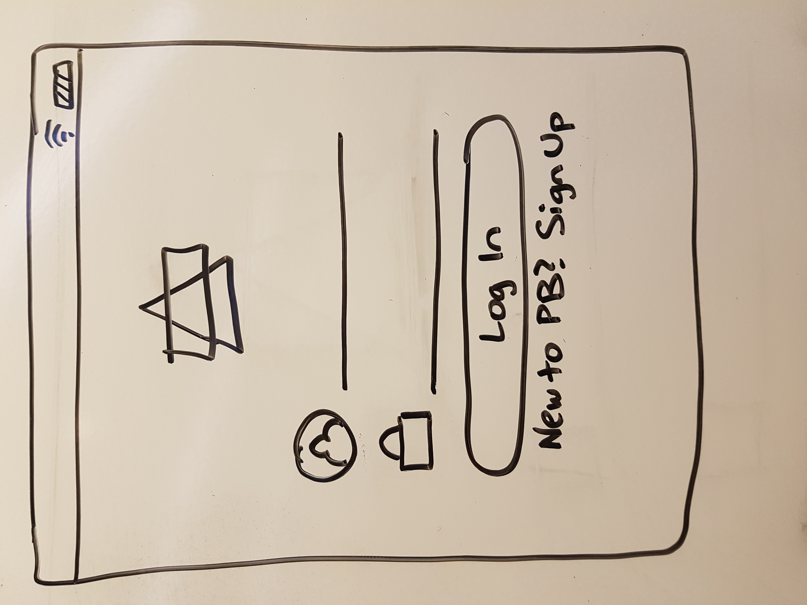 | **ACTIONS** - Click on the username field to ENTER username - Click on the password field to ENTER password - Click on the **Log In Button** to log in - Click on the **Sign Up Link** to go to the Sign Up page  **MOVERS** - **Log In**:      - validate form:         - IF valid GOTO [Home Page All Tab](#home-page-all-tab)           ELSE repeat [Login Page](#login-page) - **Sign Up**:      - GOTO [Sign Up Page](#sign-up-page)   |

# Sign Up Page

| **Screen Mockup**                                            | **Description**                                              |
| ------------------------------------------------------------ | ------------------------------------------------------------ |
| 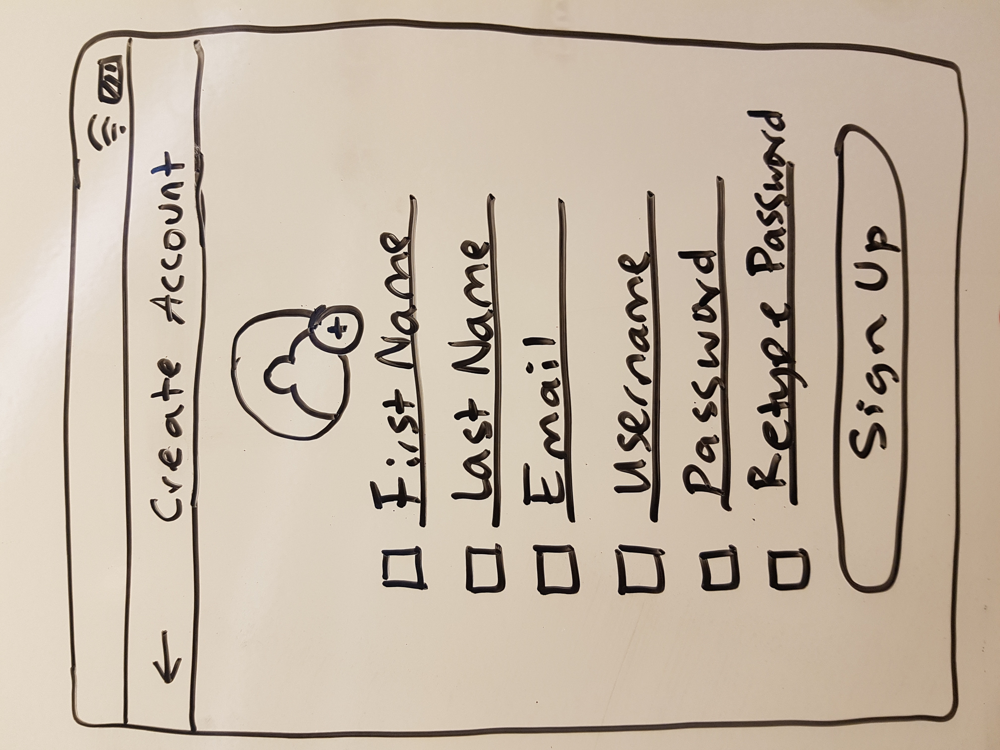 | **ACTIONS** - Click on the **Back Button** to return to Login Page - Click on the **Picture Circle** to add a picture [OPTIONAL?] - Click on the First Name field to ENTER first name - Click on the Last Name field to ENTER last name - Click on the Email field to ENTER email - Click on the Username field to ENTER username - Click on the Password field to ENTER password - Click on the Retype Password field to RETYPE password - Click on the **Sign Up Button** to go to the Home page  **MOVERS** - **Back**:      - RETURN TO [Login Page](#login-page) - **Picture**:      - LAUNCH [Add Image Fragment](#add-image-fragment) - **Sign Up**:      - validate form:         - IF valid GOTO [Home Page All Tab](#home-page-all-tab)           ELSE repeat [Sign Up Page](#sign-up-page)   |

# POCKETBOOK FOOTER

| **Screen Mockup**                                 | **Description**                                              |
| ------------------------------------------------- | ------------------------------------------------------------ |
| The Footer at the bottom of subsequent activities | - **POCKETBOOK FOOTER**:      - GOTO [Home Page](#home-page-all-tab),     - GOTO [Search Page](#search-page),     - GOTO [Add Book Fragment](#add-book-fragment),     - GOTO [Scan](#scan)     - GOTO [User Profile Owner Page](#user-profile-owner-page)   |

# Home Page All Tab

| **Screen Mockup**                                            | **Description**                                              |
| ------------------------------------------------------------ | ------------------------------------------------------------ |
| 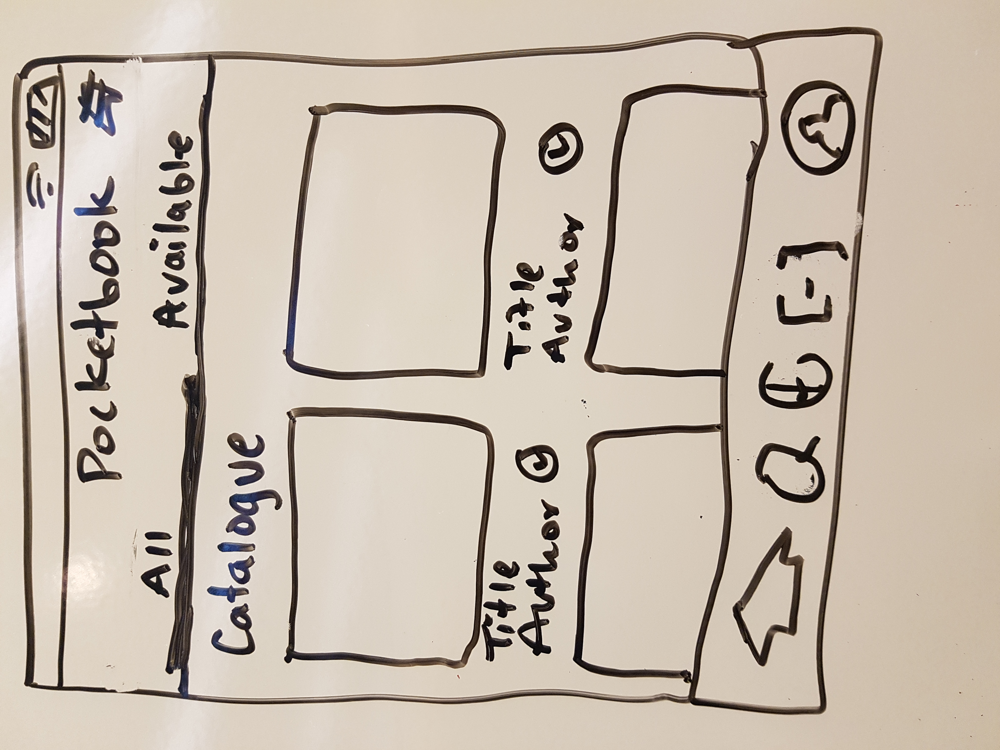 | **ACTIONS** - Click on the **Notification Icon** to view notifications - Click on the All Tab to view all books in the catalogue - Click on the Available Tab to view available books in the catalogue - Click on a **Book** to go to the Book Page - Click in the **POCKETBOOK FOOTER** to perform footer actions  **MOVERS** - **Notification**:      - GOTO [Notifications Page](#notifications-page) - **All Tab**:      - STAY ON [Home Page All Tab](#home-page-all-tab) - **Available Tab**:      - GOTO [Home Page Available Tab](#home-page-available-tab) - **Book**:      - check if user owns book:         - IF owner              IF book is available GOTO [Owner Book Page](#owner-book-page),              ELSE GOTO [Owner Book Page Not Available](#owner-book-page-not-available)           ELSE GOTO [Non Owner Book Page](#non-owner-book-page) - [**POCKETBOOK FOOTER**](#pocketbook-footer):    |

# Non Owner Book Page

| **Screen Mockup**                                            | **Description**                                              |
| ------------------------------------------------------------ | ------------------------------------------------------------ |
| 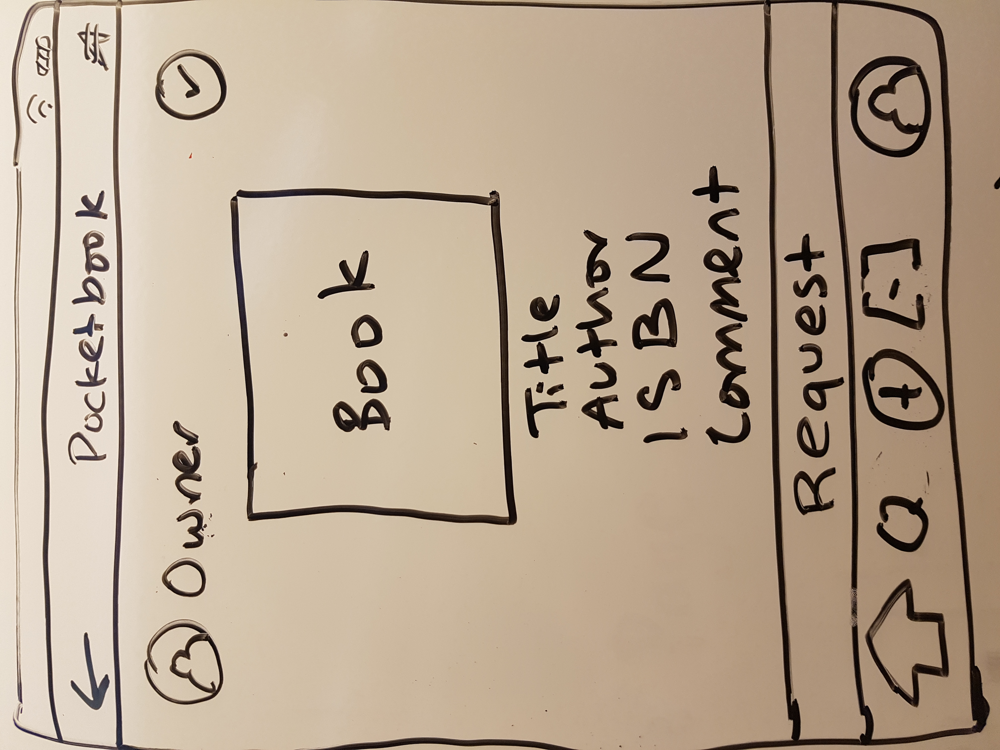 | **ACTIONS** - Click on the **Back Button** to return to *Previous Activity* - Click on the **Notification Icon** to view notifications - Click on the **Owner's Icon/Username** to view the owner's profile - Click on the **Request Button** to request the book - Click in the **POCKETBOOK FOOTER** to perform footer actions  - **Request**:      - SEND request     - NOTIFY Owner      - CHANGE book status from AVAILABLE to REQUESTED  **MOVERS** - **Back**:      - RETURN TO *Previous Activity* - **Notification**:      - GOTO [Notifications Page](#notifications-page) - **Owner's Icon/Username**:      - GOTO [View Owner Page](#view-owner-page) - [**POCKETBOOK FOOTER**](#pocketbook-footer):    |

# Non Owner Book Page Not Available

| **Screen Mockup**                                            | **Description**                                              |
| ------------------------------------------------------------ | ------------------------------------------------------------ |
| 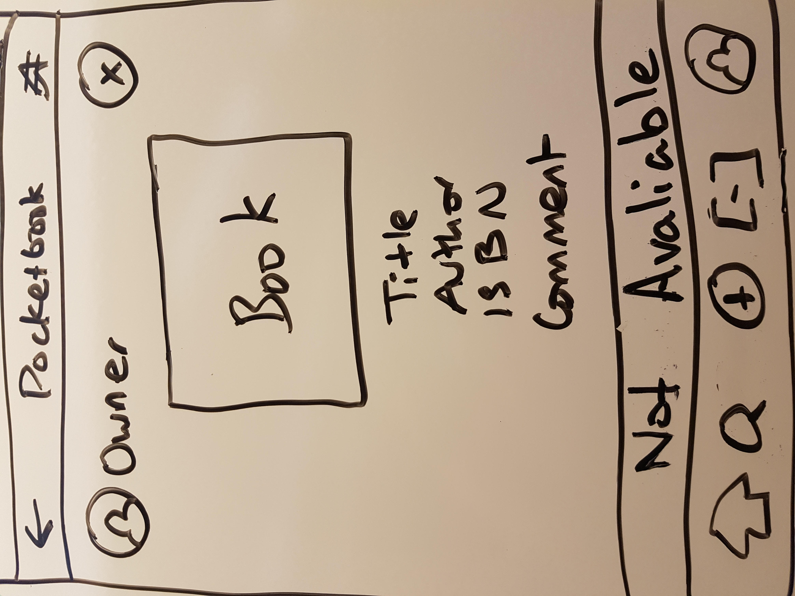 | **ACTIONS** - Click on the **Notification Icon** to view notifications - Click on the **Owner's Icon/Username** to view the owner's profile - Click in the **POCKETBOOK FOOTER** to perform footer actions  **MOVERS** - **Notification**:      - GOTO [Notifications Page](#notifications-page) - **Owner's Icon/Username**:      - GOTO [View Owner Page](#view-owner-page) - [**POCKETBOOK FOOTER**](#pocketbook-footer):    |

# Owner Book Page

| **Screen Mockup**                                            | **Description**                                              |
| ------------------------------------------------------------ | ------------------------------------------------------------ |
| Request List should not be on this page! 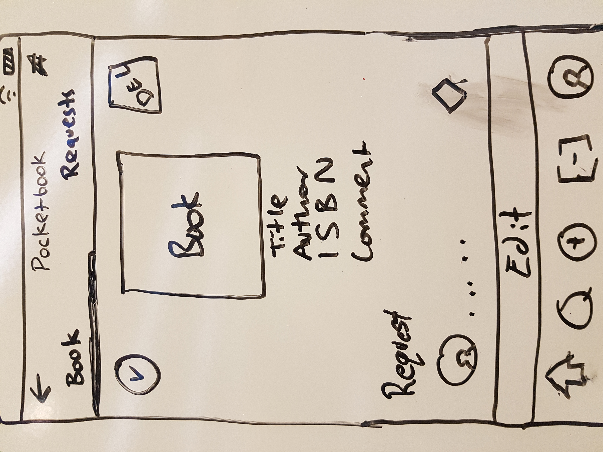 | **ACTIONS** - Click on the **Back Button** to return to *Previous Activity* - Click on the **Notification Icon** to view notifications - Click on the Book Tab to view the selected book - Click on the Requests Tab to view the book's requests - Click on the **Delete Button** to remove the book - Click on the **Edit Button** to edit the book - Click in the **POCKETBOOK FOOTER** to perform footer actions  **MOVERS** - **Back**:      - RETURN TO *Previous Activity* - **Notification**:      - GOTO [Notifications Page](#notifications-page) - **Book Tab**:      - STAY ON [Owner Book Page](#owner-book-page) - **Requests Tab**:      - GOTO [Owner Book Page Requests](#owner-book-page-requests) - **Delete**:      - LAUNCH [Delete Fragment](#delete-fragment)       IF successful delete GOTO *Previous Activity*       ELSE STAY ON [Owner Book Page](#owner-book-page) - **Edit**:      - GOTO [Edit Book Page](#edit-book-page) - [**POCKETBOOK FOOTER**](#pocketbook-footer):    |

# Owner Book Page Requests

| **Screen Mockup**                                            | **Description**                                              |
| ------------------------------------------------------------ | ------------------------------------------------------------ |
| 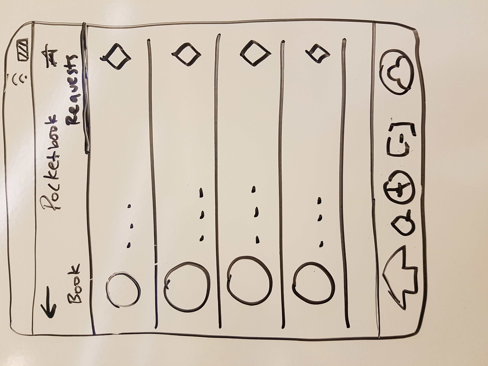 | **ACTIONS** - Click on the **Back Button** to return to *Previous Activity* - Click on the **Notification Icon** to view notifications - Click on the Book Tab to view the selected book - Click on the Requests Tab to view the book's requests - Click on the **Owner's Icon/Username** to view the owner's profile - Click on the **Request Action Button** to accept/decline the book's requests - Click in the **POCKETBOOK FOOTER** to perform footer actions  **MOVERS** - **Back**:      - RETURN TO *Previous Activity* - **Notification**:      - GOTO [Notifications Page](#notifications-page) - **Book Tab**:      - GOTO [Owner Book Page](#owner-book-page) - **Owner's Icon/Username**:      - GOTO [View Owner Page](#view-owner-page) - **Requests Tab**:      - STAY ON [Owner Book Page Requests](#owner-book-page-requests) - **Request Action**:      - LAUNCH [Request Fragment](#request-fragment)  - [**POCKETBOOK FOOTER**](#pocketbook-footer):    |

# View Owner Page

| **Screen Mockup**                                            | **Description**                                              |
| ------------------------------------------------------------ | ------------------------------------------------------------ |
| 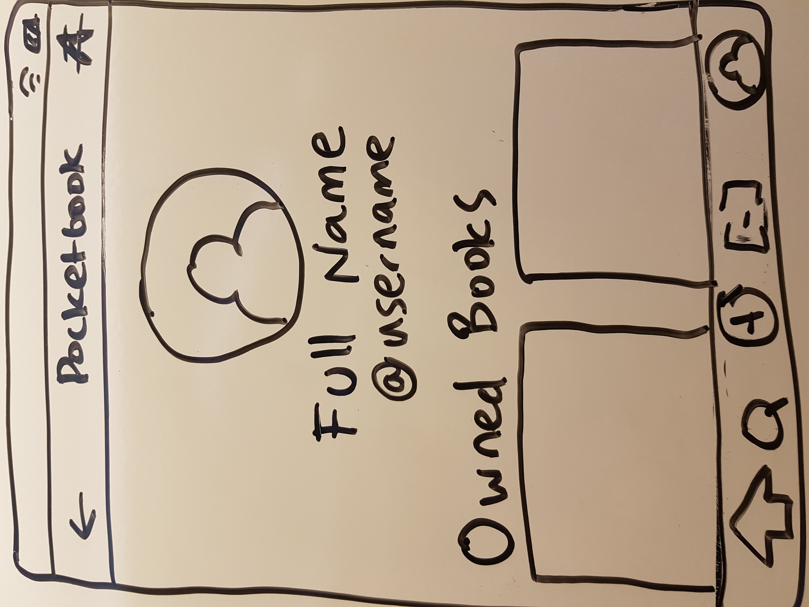 | **ACTIONS** - Click on the **Back Button** to return to *Previous Activity* - Click on the **Notification Icon** to view notifications - Click on a **Book** to go to the Book Page - Click in the **POCKETBOOK FOOTER** to perform footer actions  **MOVERS** - **Back**:      - RETURN TO *Previous Activity* - **Notification**:      - GOTO [Notifications Page](#notifications-page) - **Book**:      - check if user owns book:         - IF owner              IF book is available GOTO [Owner Book Page](#owner-book-page),              ELSE GOTO [Owner Book Page Not Available](#owner-book-page-not-available)           ELSE GOTO [Non Owner Book Page](#non-owner-book-page)  - [**POCKETBOOK FOOTER**](#pocketbook-footer):    |

# Add Book Page

| **Screen Mockup**                                            | **Description**                                              |
| ------------------------------------------------------------ | ------------------------------------------------------------ |
| 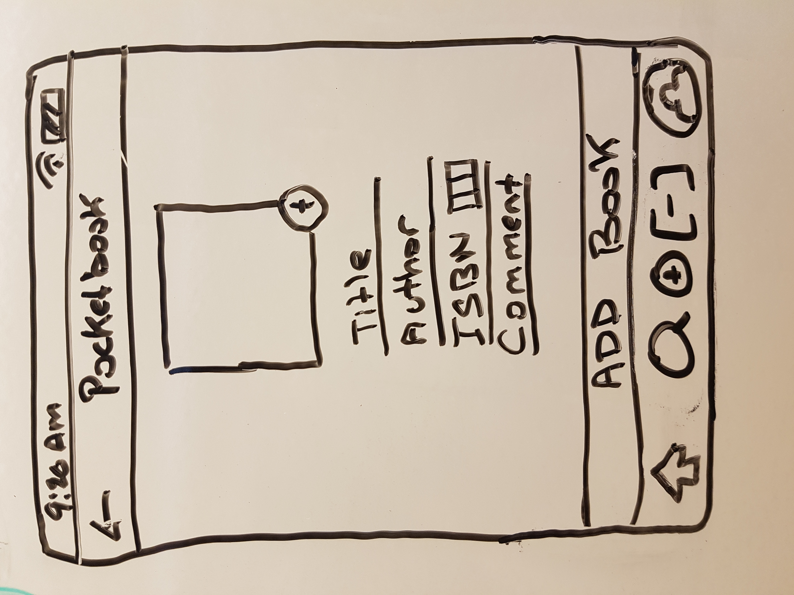 | **ACTIONS** - Click on the **Back Button** to return to *Previous Activity* - Click on the **Notification Icon** to view notifications - Click on the **Picture Rectangle** to add a picture [OPTIONAL?] - Click on the Title field to ENTER title - Click on the Author field to ENTER author - Click on the ISBN field to ENTER ISBN manually - Click on the **Scan Icon** to scan an ISBN - Click on the Comment field to ENTER comment - Click on the **Add Book Button** to add the book - Click in the **POCKETBOOK FOOTER** to perform footer actions  **MOVERS** - **Back**:      - RETURN TO *Previous Activity* - **Notification**:      - GOTO [Notifications Page](#notifications-page) - **Picture**:      - LAUNCH [Add Image Fragment](#add-image-fragment) - **Scan**:      - GOTO [Scan](#scan) - **Add**:      - SAVE book (with available status); RETURN TO *Previous Activity*  - [**POCKETBOOK FOOTER**](#pocketbook-footer):    |

# Edit Book Page

| **Screen Mockup**                                            | **Description**                                              |
| ------------------------------------------------------------ | ------------------------------------------------------------ |
| 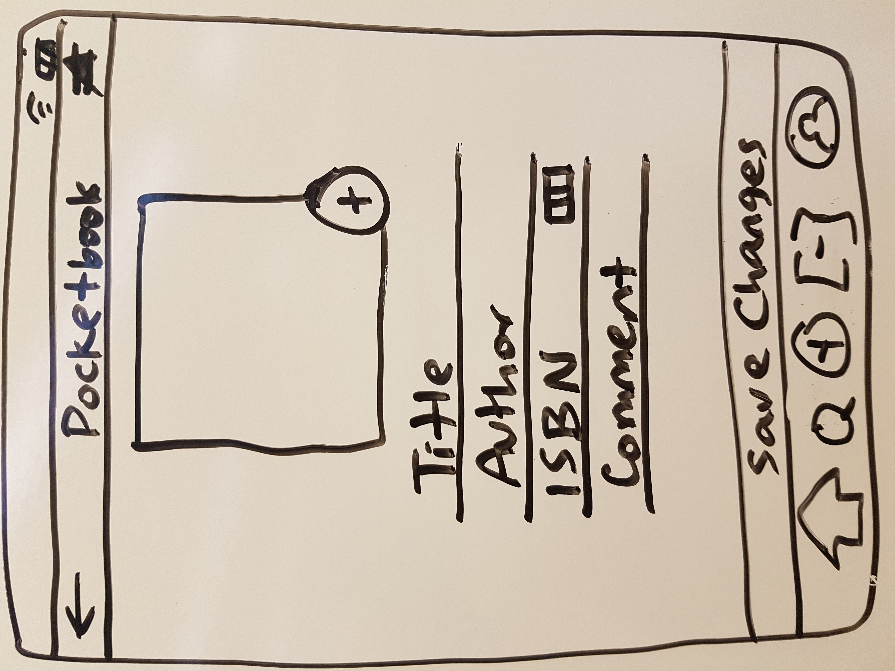 | **ACTIONS** - Click on the **Back Button** to return to *Previous Activity* - Click on the **Notification Icon** to view notifications - Click on the **Picture Rectangle** to edit the picture [OPTIONAL?] - Click on the Title field to MODIFY title - Click on the Author field to MODIFY author - Click on the ISBN field to MODIFY ISBN manually - Click on the **Scan Icon** to scan an ISBN - Click on the Comment field to MODIFY comment - Click on the **Save Changes Button** to save the book edits - Click in the **POCKETBOOK FOOTER** to perform footer actions  **MOVERS** - **Back**:      - RETURN TO *Previous Activity* - **Notification**:      - GOTO [Notifications Page](#notifications-page) - **Picture**:      - LAUNCH [Edit Image Fragment](#add-image-fragment) - **Scan**:      - GOTO [Scan](#scan) - **Save Changes**:      - SAVE book edits; RETURN TO *Previous Activity*  - [**POCKETBOOK FOOTER**](#pocketbook-footer):    |

# Scanned Book Description Page

| **Screen Mockup**                                            | **Description**                                              |
| ------------------------------------------------------------ | ------------------------------------------------------------ |
| 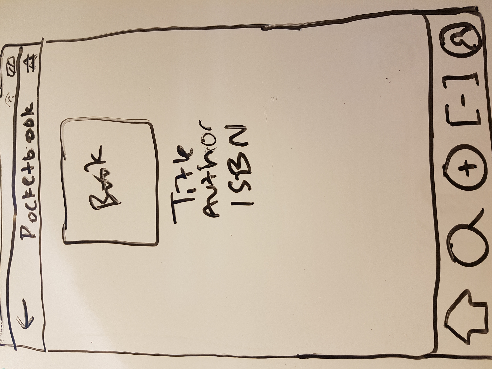 | **ACTIONS** - Click on the **Back Button** to return to *Previous Activity* - Click on the **Notification Icon** to view notifications - Click in the **POCKETBOOK FOOTER** to perform footer actions  **MOVERS** - **Back**:      - RETURN TO *Previous Activity* - **Notification**:      - GOTO [Notifications Page](#notifications-page)  - [**POCKETBOOK FOOTER**](#pocketbook-footer):    |

# User Profile Owner Page

| **Screen Mockup**                                            | **Description**                                              |
| ------------------------------------------------------------ | ------------------------------------------------------------ |
| 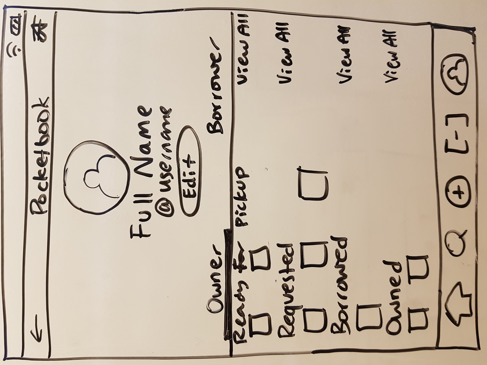 | **ACTIONS** - Click on the **Notification Icon** to view notifications - Click on the **Edit Button** to edit the profile - Click on the Owner Tab to view the books that you own - Click on the Borrower Tab to view the books that others own - Click on a **Book** to go to the Book Page - Click on a **View All** section to view all the books in that section - Click in the **POCKETBOOK FOOTER** to perform footer actions  **MOVERS** - **Notification**:      - GOTO [Notifications Page](#notifications-page) - **Edit**:      - GOTO [Edit Profile Page](#edit-profile-page) - **Owner Tab**:      - STAY ON [User Profile Owner Page](#user-profile-owner-page) - **Borrower Tab**:      - GOTO [User Profile Borrower Tab](#user-profile-borrower-tab) - **Book**:      - IF book is available GOTO [Owner Book Page](#owner-book-page),        ELSE GOTO [Owner Book Page Not Available](#owner-book-page-not-available) - **View All**:      - GOTO [Profile View All Page](#profile-view-all-page) - [**POCKETBOOK FOOTER**](#pocketbook-footer):    |

# User Profile Borrower Tab

| **Screen Mockup**                                            | **Description**                                              |
| ------------------------------------------------------------ | ------------------------------------------------------------ |
| 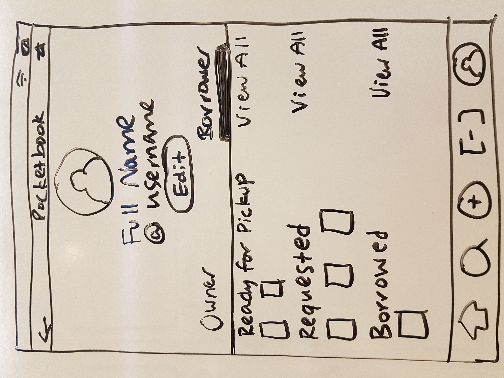 | **ACTIONS** - Click on the **Notification Icon** to view notifications - Click on the **Edit Button** to edit the profile - Click on the Owner Tab to view the books that you own - Click on the Borrower Tab to view the books that others own - Click on a **Book** to go to the Book Page - Click on a **View All** section to view all the books in that section - Click in the **POCKETBOOK FOOTER** to perform footer actions  **MOVERS** - **Notification**:      - GOTO [Notifications Page](#notifications-page) - **Edit**:      - GOTO [Edit Profile Page](#edit-profile-page) - **Owner Tab**:      - GOTO [User Profile Owner Page](#user-profile-owner-page) - **Borrower Tab**:      - STAY ON [User Profile Borrower Tab](#user-profile-borrower-tab) - **Book**:      - GOTO [Non Owner Book Page](#non-owner-book-page) - **View All**:      - GOTO [Profile View All Page](#profile-view-all-page) - [**POCKETBOOK FOOTER**](#pocketbook-footer):    |

# Edit Profile Page

| **Screen Mockup**                                            | **Description**                                              |
| ------------------------------------------------------------ | ------------------------------------------------------------ |
| 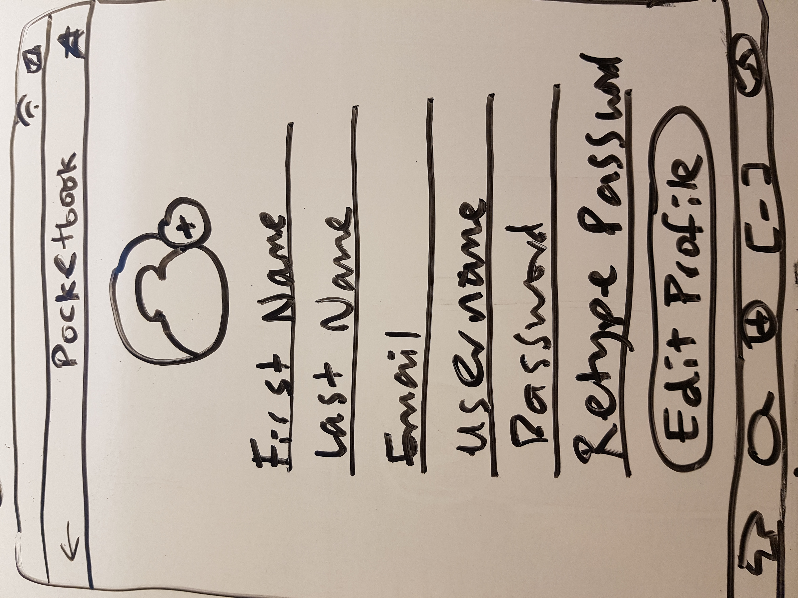 | **ACTIONS** - Click on the **Back Button** to return to *Previous Activity* - Click on the **Picture Circle** to edit a picture [OPTIONAL?] - Click on the First Name field to MODIFY first name - Click on the Last Name field to MODIFY last name - Click on the Email field to MODIFY email - Click on the Username field to MODIFY username - Click on the Password field to MODIFY password - Click on the Retype Password field to RETYPE password - Click on the **Edit Profile Button** to edit the profile  **MOVERS** - **Back**:      - RETURN TO *Previous Activity* - **Picture**:      - LAUNCH [Edit Image Fragment](#edit-image-fragment) - **Edit Profile**:      - validate form:         - IF valid GOTO [User Profile Owner Page](#user-profile-owner-page)           ELSE repeat [Edit Profile Page](#edit-profile-page)   |

# Profile View All Page

| **Screen Mockup**                                            | **Description**                                              |
| ------------------------------------------------------------ | ------------------------------------------------------------ |
| 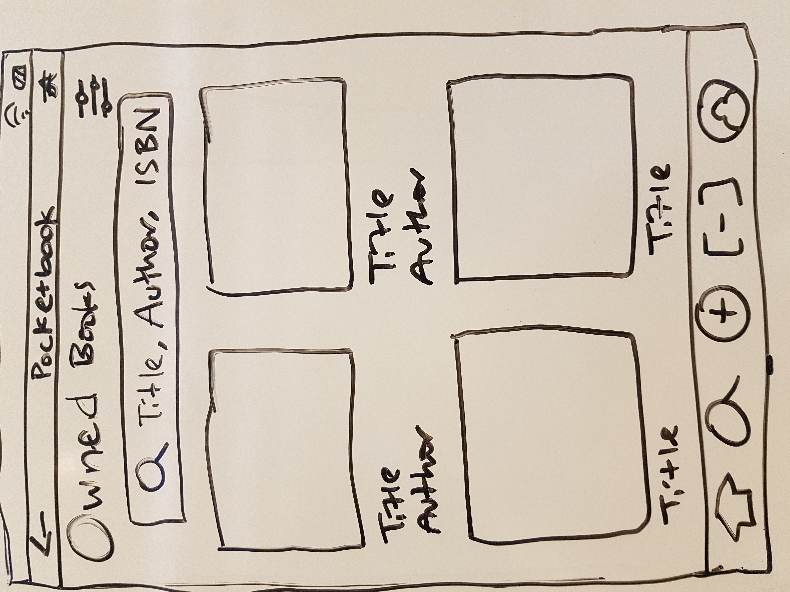 | **ACTIONS** - Click on the **Back Button** to return to *Previous Activity* - Click on the **Notification Icon** to view notifications - Click on the **Filter Icon** to filter the books by status - Click on the **Search Bar** to search through the books - Click on a **Book** to go to the Book Page - Click in the **POCKETBOOK FOOTER** to perform footer actions  **MOVERS** - **Back**:      - RETURN TO *Previous Activity* - **Notification**:      - GOTO [Notifications Page](#notifications-page) - **Filter**:      - LAUNCH [Filter Owned Books Fragment](#filter-owned-books-fragment) - **Search**:      - GOTO [Search Page](#search-page) - **Book**:      - check if user owns book:         - IF owner              IF book is available GOTO [Owner Book Page](#owner-book-page),              ELSE GOTO [Owner Book Page Not Available](#owner-book-page-not-available)           ELSE GOTO [Non Owner Book Page](#non-owner-book-page)  - [**POCKETBOOK FOOTER**](#pocketbook-footer):    |

# Profile View All Page Requested

| **Screen Mockup**                                            | **Description**                                              |
| ------------------------------------------------------------ | ------------------------------------------------------------ |
| 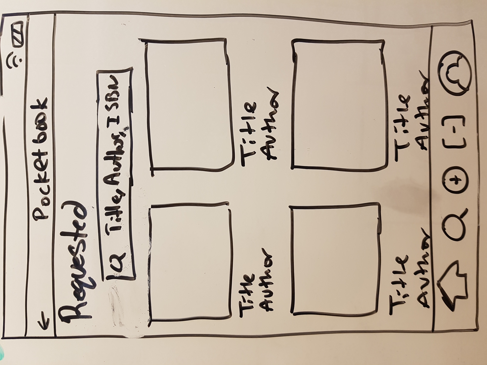 | **ACTIONS** - Click on the **Back Button** to return to *Previous Activity* - Click on the **Notification Icon** to view notifications - Click on the **Search Bar** to search through the books - Click on a **Book** to go to the Book Page - Click in the **POCKETBOOK FOOTER** to perform footer actions  **MOVERS** - **Back**:      - RETURN TO *Previous Activity* - **Notification**:      - GOTO [Notifications Page](#notifications-page) - **Search**:      - GOTO [Search Page](#search-page) - **Book**:      - check if user owns book:         - IF owner              IF book is available GOTO [Owner Book Page](#owner-book-page),              ELSE GOTO [Owner Book Page Not Available](#owner-book-page-not-available)           ELSE GOTO [Non Owner Book Page](#non-owner-book-page)  - [**POCKETBOOK FOOTER**](#pocketbook-footer):    |

# Search Page

| **Screen Mockup**                                            | **Description**                                              |
| ------------------------------------------------------------ | ------------------------------------------------------------ |
| 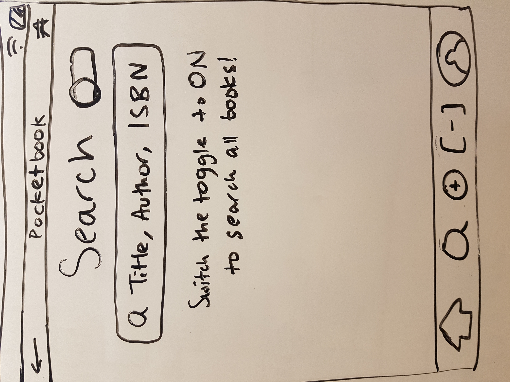 | **ACTIONS** - Click on the **Back Button** to return to *Previous Activity* - Click on the **Notification Icon** to view notifications - Click on the Toggle button to toggle the search type - Click on the **Search Bar** to search through the books - Click in the **POCKETBOOK FOOTER** to perform footer actions  **MOVERS** - **Back**:      - RETURN TO *Previous Activity* - **Notification**:      - GOTO [Notifications Page](#notifications-page) - **Search**:      - GOTO *Results Page*  - [**POCKETBOOK FOOTER**](#pocketbook-footer):    |

# Notifications Page

| **Screen Mockup**                                            | **Description**                                              |
| ------------------------------------------------------------ | ------------------------------------------------------------ |
| 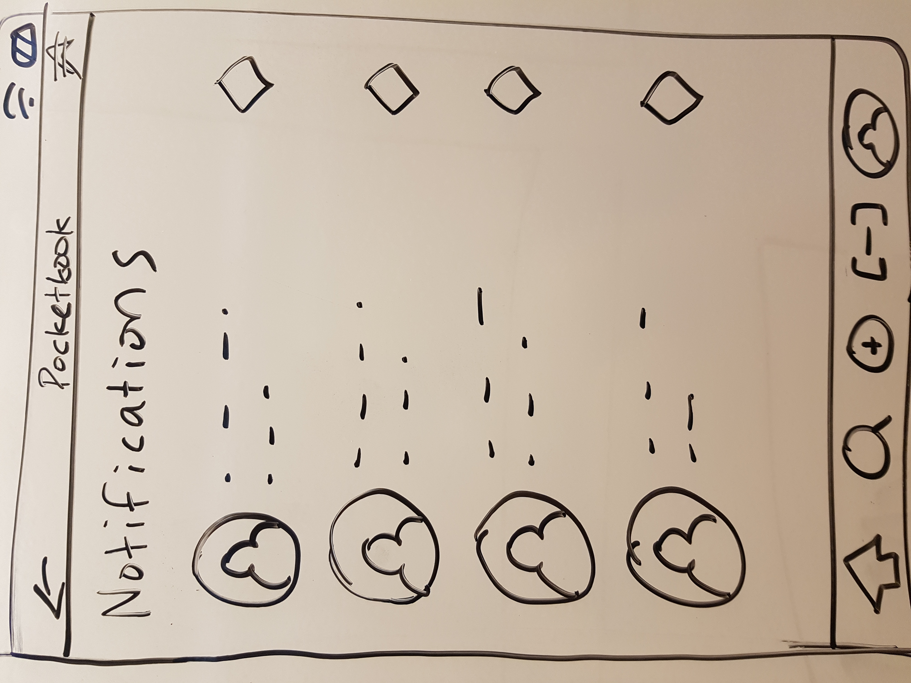 | **ACTIONS** - Click on the **Back Button** to return to *Previous Activity* - Click on the **Owner's Icon/Username** to view the owner's profile - Click on a **Book** (icons on the right) to go to the Book Page - Click in the **POCKETBOOK FOOTER** to perform footer actions  **MOVERS** - **Back**:      - RETURN TO *Previous Activity* - **Owner's Icon/Username**:      - GOTO [View Owner Page](#view-owner-page) - **Book**:      - check if user owns book:         - IF owner              IF book is available GOTO [Owner Book Page](#owner-book-page),              ELSE GOTO [Owner Book Page Not Available](#owner-book-page-not-available)           ELSE GOTO [Non Owner Book Page](#non-owner-book-page)  - [**POCKETBOOK FOOTER**](#pocketbook-footer):    |

# Set Location Page

| **Screen Mockup**                                            | **Description**                                              |
| ------------------------------------------------------------ | ------------------------------------------------------------ |
| 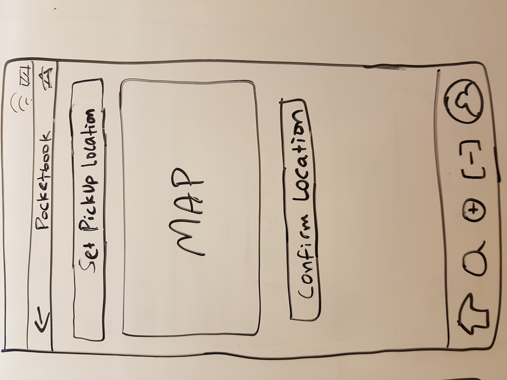 | The Map shows where the pickup location is.  **ACTIONS** - Click on the **Back Button** to return to *Previous Activity* - Click on the **Notification Icon** to view notifications - Click on the **Set Pickup Location Button** to set the location - Click on the **Confirm Location Button** to confirm the chosen location - Click in the **POCKETBOOK FOOTER** to perform footer actions  **MOVERS** - **Back**:      - RETURN TO *Previous Activity* - **Notification**:      - GOTO [Notifications Page](#notifications-page) - **Set Pickup Location**:      - GOTO [Google Maps](#google-maps) TO [Set Location Page](#set-location-page) - **Confirm Location**:      RETURN TO *Previous Activity*  - [**POCKETBOOK FOOTER**](#pocketbook-footer):    |

# Get Location Page

| **Screen Mockup**                                            | **Description**                                              |
| ------------------------------------------------------------ | ------------------------------------------------------------ |
| 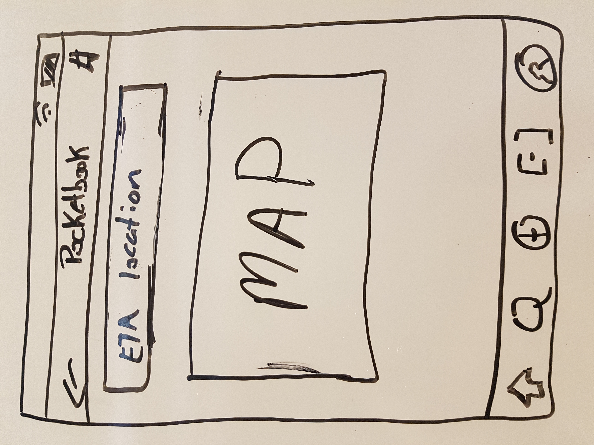 | The Map shows where the pickup location is.  **ACTIONS** - Click on the **Back Button** to return to *Previous Activity* - Click on the **Notification Icon** to view notifications - Click on the **ETA Location Button** to get directions to the location - Click in the **POCKETBOOK FOOTER** to perform footer actions  **MOVERS** - **Back**:      - RETURN TO *Previous Activity* - **Notification**:      - GOTO [Notifications Page](#notifications-page) - **ETA Location**:      - GOTO [Google Maps](#google-maps) TO [Get Location Page](#get-location-page)  - [**POCKETBOOK FOOTER**](#pocketbook-footer):    |

# Edit Image Fragment

| **Screen Mockup**                                            | **Description**                                              |
| ------------------------------------------------------------ | ------------------------------------------------------------ |
| 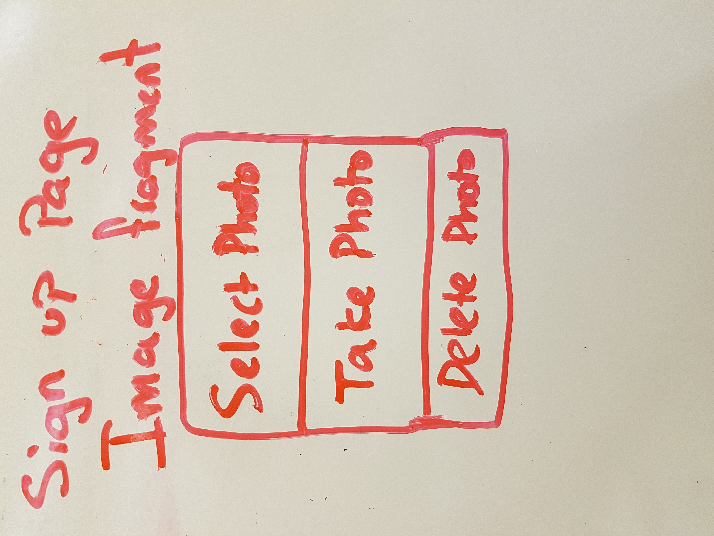 | **ACTIONS** - Click on the **Select Photo Button** to go to the Android Gallery - Click on the **Take Photo Button** to go to the Camera App - Click on the **Remove Photo Button** to return to the Sign Up Page  **MOVERS** - **Select Photo**:      - GOTO [Android Gallery](#android-gallery) TO [Confirm Photo Page](#confirm-photo-page) TO *Previous Activity* - **Take Photo**:      - GOTO [Camera App](#camera-app) TO [Confirm Photo Page](#confirm-photo-page) TO *Previous Activity* - **Remove Photo**:      - RETURN TO *Previous Activity* (after removing photo)   |

# Request Fragment

| **Screen Mockup**                                            | **Description**                                              |
| ------------------------------------------------------------ | ------------------------------------------------------------ |
| 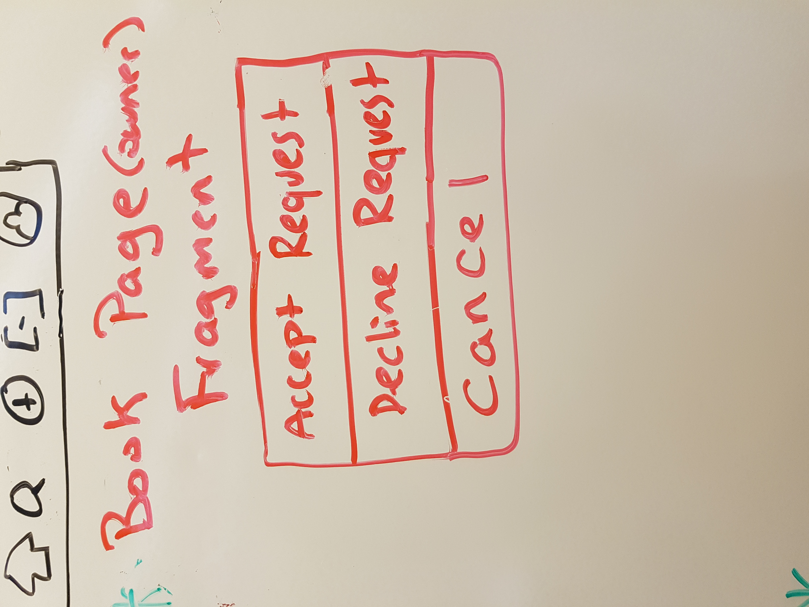 | **ACTIONS** - Click on the **Accept Request Button** to accept the request - Click on the **Decline Request Button** to decline the request - Click on the **Cancel Button** to exit the fragment  **MOVERS** - **Accept Request**:      - SEND accept request     - NOTIFY Borrower that request is accepted     - SEND decline request to other requesters     - CHANGE book status from REQUESTED to ACCEPTED     - RETURN to *Previous Activity*  - **Decline Request**:      - SEND decline request     - NOTIFY Borrower that request is declined     - IF there are no other requests          - CHANGE book status from REQUESTED to AVAILABLE     - RETURN to *Previous Activity*  - **Cancel**:      - RETURN to *Previous Activity*    |

# Delete Fragment

| **Screen Mockup**                                            | **Description**                                              |
| ------------------------------------------------------------ | ------------------------------------------------------------ |
| 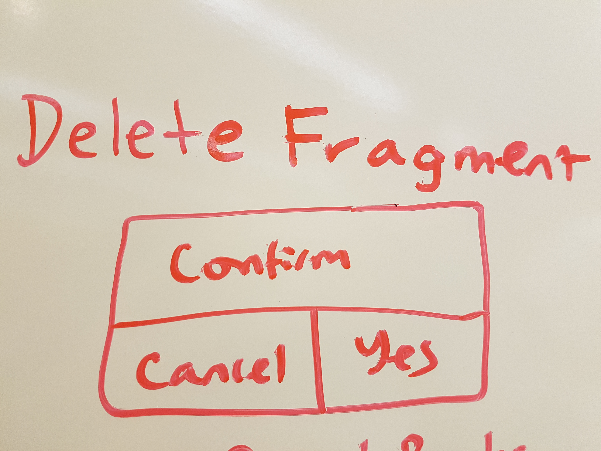 | **ACTIONS** - Click on the **Yes Button** to confirm the deletion - Click on the **Cancel Button** to exit the fragment  **MOVERS** - **YES**:      - DELETE the specified item     - RETURN to *Previous Activity*  - **Cancel**:      - RETURN to *Previous Activity*    |

# Filter Owned Books Fragment

| **Screen Mockup**                                            | **Description**                                              |
| ------------------------------------------------------------ | ------------------------------------------------------------ |
| 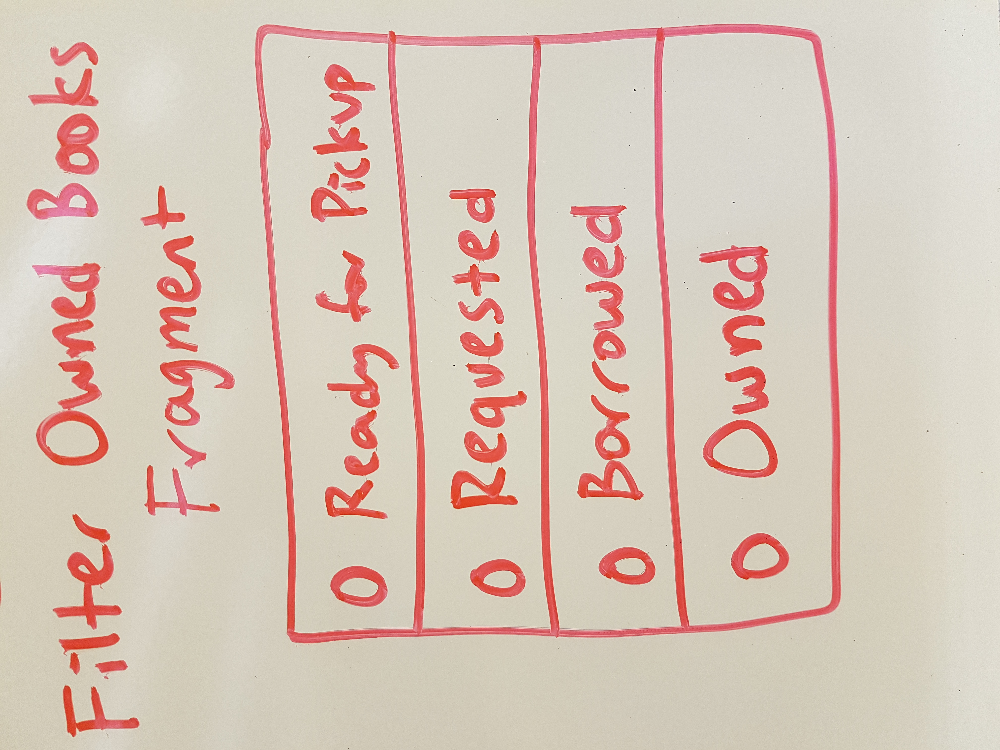 | **ACTIONS** - Click on the **Ready for Pickup Button** to see ACCEPTED books - Click on the **Requested Button** to see REQUESTED books - Click on the **Borrowed Button** to see BORROWED books - Click on the **Owned Button** to see OWNED books  **MOVERS** - **Ready for Pickup**:      - Include accepted books in [Profile View All Page](#profile-view-all-page) list - **Requested**:      - Include requested books in [Profile View All Page](#profile-view-all-page) list - **Borrowed**:      - Include borrowed books in [Profile View All Page](#profile-view-all-page) list - **Owned**:      - Include owned books in [Profile View All Page](#profile-view-all-page) list - **Apply**:      - RETURN to *Previous Activity* with filter options set   |

# Scan Book Fragment

| **Screen Mockup**                                            | **Description**                                              |
| ------------------------------------------------------------ | ------------------------------------------------------------ |
| 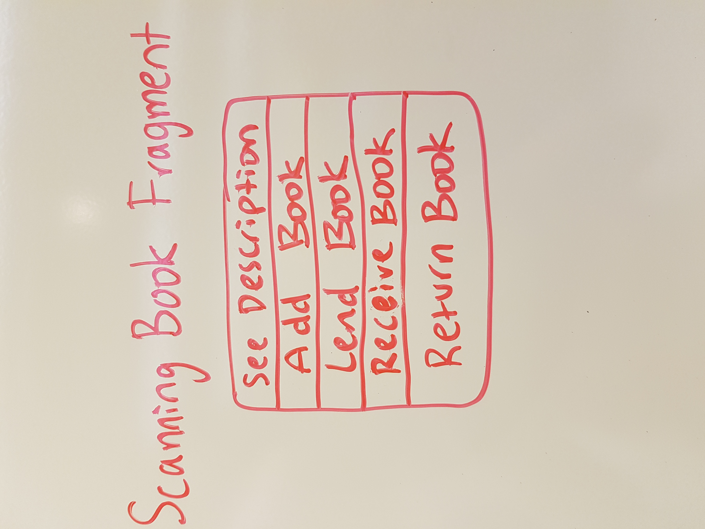 | **ACTIONS** - Click on the **See Description Button** to see the scanned book's description - Click on the **Add Book** to add the book - Click on the **Lend Book Button** to lend the book - Click on the **Receive Book Button** to receive the book - Click on the **Return Book Button** to return the book  **MOVERS** - **See Description**:      - GOTO [Scanned Book Description Page](#scanned-book-description-page) - **Add Book**:      - GOTO [Add Book Page](#add-book-page) (and prefill fields) - **Lend Book**:      - CHANGE book status from ACCEPTED to BORROWED     - RETURN to *Previous Activity* - **Receive Book**:      - CHANGE book status from BORROWED to AVAILABLE     - RETURN to *Previous Activity* - **Return Book**:      - CHANGE book status from BORROWED to AVAILABLE     - RETURN to *Previous Activity*   |

# Add Book Fragment

| **Screen Mockup**                                            | **Description**                                              |
| ------------------------------------------------------------ | ------------------------------------------------------------ |
| 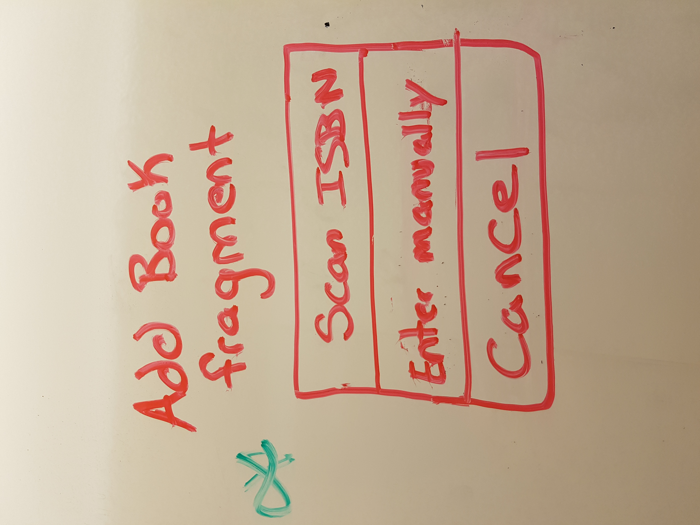 | **ACTIONS** - Click on the **Scan ISBN Button** to scan the book's ISBN - Click on the **Enter Manually Button** to enter the book by hand - Click on the **Cancel Button** to exit the fragment  **MOVERS** - **Scan ISBN**:      - GOTO [Scan](#scan)  - **Enter Manually**:      - GOTO [Add Book Page](#add-book-page)  - **Cancel**:      - RETURN to *Previous Activity*    |

# System Activities/Dialogs

## Android Gallery

| **From**                                  | **To**                                    |
| ----------------------------------------- | ----------------------------------------- |
| [Add Image Fragment](#add-image-fragment) | [Confirm Photo Page](#confirm-photo-page) |

## Camera App

| **From**                                  | **To**                                    |
| ----------------------------------------- | ----------------------------------------- |
| [Add Image Fragment](#add-image-fragment) | [Confirm Photo Page](#confirm-photo-page) |

## Scan

| **From**                                                     | **To**                         |
| ------------------------------------------------------------ | ------------------------------ |
| [Add Book Page](#add-book-page) [Edit Book Page](#edit-book-page) [Add Book Fragment](#add-book-fragment) [**POCKETBOOK FOOTER**](#pocketbook-footer) | *Calling Activity or Fragment* |

## Notifications

| **From**           | **To**            |
| ------------------ | ----------------- |
| *Calling Activity* | *Result Activity* |

## Google Maps

| **From**                                                     | **To**                                                       |
| ------------------------------------------------------------ | ------------------------------------------------------------ |
| [Set Location Page](#set-location-page) [Get Location Page](#get-location-page) | [Set Location Page](#set-location-page) [Get Location Page](#get-location-page) |

