# Login Page

| **Screen Mockup**                                            | **Description**                                              |
| ------------------------------------------------------------ | ------------------------------------------------------------ |
| 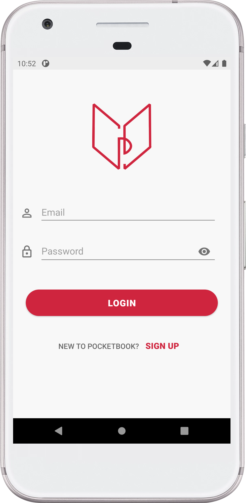 | **ACTIONS** &nbsp;&nbsp;&nbsp;&nbsp;- Click on the username field to ENTER username &nbsp;&nbsp;&nbsp;&nbsp;- Click on the password field to ENTER password &nbsp;&nbsp;&nbsp;&nbsp;- Click on the **Log In Button** to log in &nbsp;&nbsp;&nbsp;&nbsp;- Click on the **Sign Up Link** to go to the Sign Up page  **MOVERS** &nbsp;&nbsp;&nbsp;&nbsp;- **Log In**:  &nbsp;&nbsp;&nbsp;&nbsp;&nbsp;&nbsp;&nbsp;&nbsp;- validate form: &nbsp;&nbsp;&nbsp;&nbsp;&nbsp;&nbsp;&nbsp;&nbsp;&nbsp;&nbsp;&nbsp;&nbsp;- IF valid GOTO [Home Page All Tab](#home-page-all-tab) &nbsp;&nbsp;&nbsp;&nbsp;&nbsp;&nbsp;&nbsp;&nbsp;&nbsp;&nbsp;&nbsp;&nbsp;&nbsp;&nbsp;ELSE repeat [Login Page](#login-page) &nbsp;&nbsp;&nbsp;&nbsp;- **Sign Up**:  &nbsp;&nbsp;&nbsp;&nbsp;&nbsp;&nbsp;&nbsp;&nbsp;- GOTO [Sign Up Page](#sign-up-page)   |

# Sign Up Page

| **Screen Mockup**                                            | **Description**                                              |
| ------------------------------------------------------------ | ------------------------------------------------------------ |
| 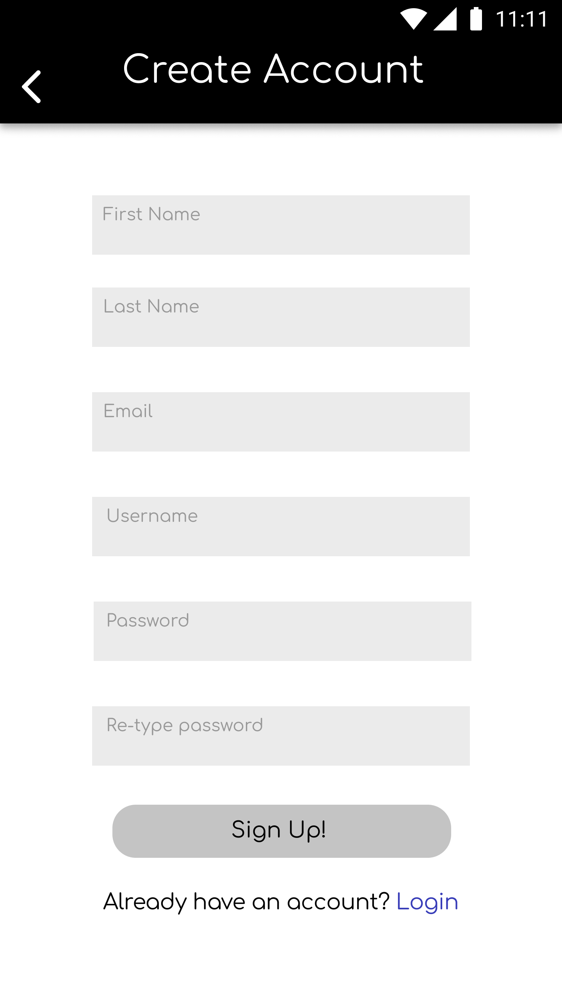 | **ACTIONS** &nbsp;&nbsp;&nbsp;&nbsp;- Click on the **Back Button** to return to Login Page &nbsp;&nbsp;&nbsp;&nbsp;- Click on the **Picture Circle** to add a picture [OPTIONAL?] &nbsp;&nbsp;&nbsp;&nbsp;- Click on the First Name field to ENTER first name &nbsp;&nbsp;&nbsp;&nbsp;- Click on the Last Name field to ENTER last name &nbsp;&nbsp;&nbsp;&nbsp;- Click on the Email field to ENTER email &nbsp;&nbsp;&nbsp;&nbsp;- Click on the Username field to ENTER username &nbsp;&nbsp;&nbsp;&nbsp;- Click on the Password field to ENTER password &nbsp;&nbsp;&nbsp;&nbsp;- Click on the Retype Password field to RETYPE password &nbsp;&nbsp;&nbsp;&nbsp;- Click on the **Sign Up Button** to go to the Home page  **MOVERS** &nbsp;&nbsp;&nbsp;&nbsp;- **Back**:  &nbsp;&nbsp;&nbsp;&nbsp;&nbsp;&nbsp;&nbsp;&nbsp;- RETURN TO [Login Page](#login-page) &nbsp;&nbsp;&nbsp;&nbsp;- **Picture**:  &nbsp;&nbsp;&nbsp;&nbsp;&nbsp;&nbsp;&nbsp;&nbsp;- LAUNCH [Add Image Fragment](#add-image-fragment) &nbsp;&nbsp;&nbsp;&nbsp;- **Sign Up**:  &nbsp;&nbsp;&nbsp;&nbsp;&nbsp;&nbsp;&nbsp;&nbsp;- validate form: &nbsp;&nbsp;&nbsp;&nbsp;&nbsp;&nbsp;&nbsp;&nbsp;&nbsp;&nbsp;  - IF valid GOTO [Home Page All Tab](#home-page-all-tab) &nbsp;&nbsp;&nbsp;&nbsp;&nbsp;&nbsp;&nbsp;&nbsp;&nbsp;&nbsp;&nbsp;&nbsp;&nbsp;&nbsp;ELSE repeat [Sign Up Page](#sign-up-page)   |

# POCKETBOOK FOOTER

| **Screen Mockup**                                 | **Description**                                              |
| ------------------------------------------------- | ------------------------------------------------------------ |
| The Footer at the bottom of subsequent activities | - **POCKETBOOK FOOTER**:  &nbsp;&nbsp;&nbsp;&nbsp;- GOTO [Home Page](#home-page-all-tab), &nbsp;&nbsp;&nbsp;&nbsp;- GOTO [Search Page](#search-page), &nbsp;&nbsp;&nbsp;&nbsp;- GOTO [Add Book Fragment](#add-book-fragment), &nbsp;&nbsp;&nbsp;&nbsp;- GOTO [Scan](#scan) &nbsp;&nbsp;&nbsp;&nbsp;- GOTO [User Profile Owner Page](#user-profile-owner-page)   |

# Home Page All Tab

| **Screen Mockup**                                            | **Description**                                              |
| ------------------------------------------------------------ | ------------------------------------------------------------ |
| 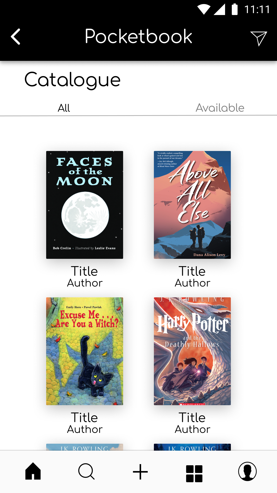 | **ACTIONS** &nbsp;&nbsp;&nbsp;&nbsp;- Click on the **Notification Icon** to view notifications &nbsp;&nbsp;&nbsp;&nbsp;- Click on the All Tab to view all books in the catalogue &nbsp;&nbsp;&nbsp;&nbsp;- Click on the Available Tab to view available books in the catalogue &nbsp;&nbsp;&nbsp;&nbsp;- Click on a **Book** to go to the Book Page &nbsp;&nbsp;&nbsp;&nbsp;- Click in the **POCKETBOOK FOOTER** to perform footer actions  **MOVERS** &nbsp;&nbsp;&nbsp;&nbsp;- **Notification**:  &nbsp;&nbsp;&nbsp;&nbsp;&nbsp;&nbsp;&nbsp;&nbsp;- GOTO [Notifications Page](#notifications-page) &nbsp;&nbsp;&nbsp;&nbsp;- **All Tab**:  &nbsp;&nbsp;&nbsp;&nbsp;&nbsp;&nbsp;&nbsp;&nbsp;- STAY ON [Home Page All Tab](#home-page-all-tab) &nbsp;&nbsp;&nbsp;&nbsp;- **Available Tab**:  &nbsp;&nbsp;&nbsp;&nbsp;&nbsp;&nbsp;&nbsp;&nbsp;- GOTO [Home Page Available Tab](#home-page-available-tab) &nbsp;&nbsp;&nbsp;&nbsp;- **Book**:  &nbsp;&nbsp;&nbsp;&nbsp;&nbsp;&nbsp;&nbsp;&nbsp;- check if user owns book: &nbsp;&nbsp;&nbsp;&nbsp;&nbsp;&nbsp;&nbsp;&nbsp;&nbsp;&nbsp;  - IF owner  &nbsp;&nbsp;&nbsp;&nbsp;&nbsp;&nbsp;&nbsp;&nbsp;&nbsp;&nbsp;&nbsp;&nbsp;&nbsp;&nbsp;&nbsp;&nbsp;- IF book is available GOTO [Owner Book Page](#owner-book-page),  &nbsp;&nbsp;&nbsp;&nbsp;&nbsp;&nbsp;&nbsp;&nbsp;&nbsp;&nbsp;&nbsp;&nbsp;&nbsp;&nbsp;&nbsp;&nbsp;&nbsp;&nbsp;ELSE GOTO [Owner Book Page Not Available](#owner-book-page-not-available) &nbsp;&nbsp;&nbsp;&nbsp;&nbsp;&nbsp;&nbsp;&nbsp;&nbsp;&nbsp;&nbsp;&nbsp;&nbsp;&nbsp;ELSE GOTO [Non Owner Book Page](#non-owner-book-page) &nbsp;&nbsp;&nbsp;&nbsp;- [**POCKETBOOK FOOTER**](#pocketbook-footer)    |

# Non Owner Book Page

| **Screen Mockup**                                            | **Description**                                              |
| ------------------------------------------------------------ | ------------------------------------------------------------ |
| 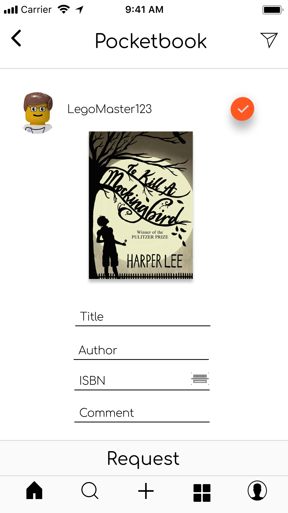 | **ACTIONS** &nbsp;&nbsp;&nbsp;&nbsp;- Click on the **Back Button** to return to *Previous Activity* &nbsp;&nbsp;&nbsp;&nbsp;- Click on the **Notification Icon** to view notifications &nbsp;&nbsp;&nbsp;&nbsp;- Click on the **Owner's Icon/Username** to view the owner's profile &nbsp;&nbsp;&nbsp;&nbsp;- Click on the **Request Button** to request the book &nbsp;&nbsp;&nbsp;&nbsp;- Click in the **POCKETBOOK FOOTER** to perform footer actions  - **Request**:  &nbsp;&nbsp;&nbsp;&nbsp;- SEND request &nbsp;&nbsp;&nbsp;&nbsp;- NOTIFY Owner  &nbsp;&nbsp;&nbsp;&nbsp;- CHANGE book status from AVAILABLE to REQUESTED  **MOVERS** &nbsp;&nbsp;&nbsp;&nbsp;- **Back**:  &nbsp;&nbsp;&nbsp;&nbsp;&nbsp;&nbsp;&nbsp;&nbsp;- RETURN TO *Previous Activity* &nbsp;&nbsp;&nbsp;&nbsp;- **Notification**:  &nbsp;&nbsp;&nbsp;&nbsp;&nbsp;&nbsp;&nbsp;&nbsp;- GOTO [Notifications Page](#notifications-page) &nbsp;&nbsp;&nbsp;&nbsp;- **Owner's Icon/Username**:  &nbsp;&nbsp;&nbsp;&nbsp;&nbsp;&nbsp;&nbsp;&nbsp;- GOTO [View Owner Page](#view-owner-page) &nbsp;&nbsp;&nbsp;&nbsp;- [**POCKETBOOK FOOTER**](#pocketbook-footer)    |

# Non Owner Book Page Not Available

| **Screen Mockup**                                            | **Description**                                              |
| ------------------------------------------------------------ | ------------------------------------------------------------ |
| 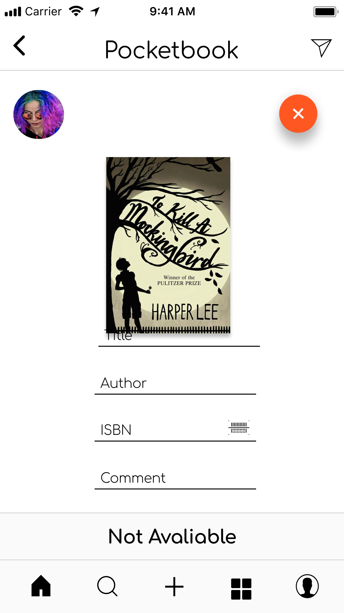 | **ACTIONS** &nbsp;&nbsp;&nbsp;&nbsp;- Click on the **Notification Icon** to view notifications &nbsp;&nbsp;&nbsp;&nbsp;- Click on the **Owner's Icon/Username** to view the owner's profile &nbsp;&nbsp;&nbsp;&nbsp;- Click in the **POCKETBOOK FOOTER** to perform footer actions  **MOVERS** &nbsp;&nbsp;&nbsp;&nbsp;- **Notification**:  &nbsp;&nbsp;&nbsp;&nbsp;&nbsp;&nbsp;&nbsp;&nbsp;- GOTO [Notifications Page](#notifications-page) &nbsp;&nbsp;&nbsp;&nbsp;- **Owner's Icon/Username**:  &nbsp;&nbsp;&nbsp;&nbsp;&nbsp;&nbsp;&nbsp;&nbsp;- GOTO [View Owner Page](#view-owner-page) &nbsp;&nbsp;&nbsp;&nbsp;- [**POCKETBOOK FOOTER**](#pocketbook-footer)    |

# Owner Book Page

| **Screen Mockup**                                            | **Description**                                              |
| ------------------------------------------------------------ | ------------------------------------------------------------ |
| 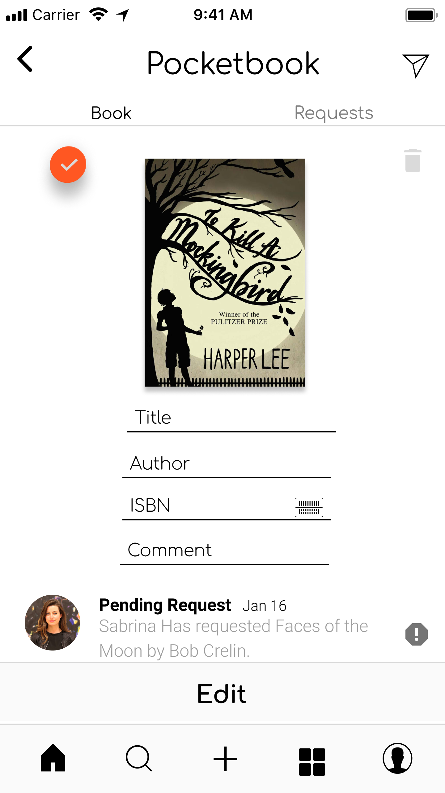 | **ACTIONS** &nbsp;&nbsp;&nbsp;&nbsp;- Click on the **Back Button** to return to *Previous Activity* &nbsp;&nbsp;&nbsp;&nbsp;- Click on the **Notification Icon** to view notifications &nbsp;&nbsp;&nbsp;&nbsp;- Click on the Book Tab to view the selected book &nbsp;&nbsp;&nbsp;&nbsp;- Click on the Requests Tab to view the book's requests &nbsp;&nbsp;&nbsp;&nbsp;- Click on the **Delete Button** to remove the book &nbsp;&nbsp;&nbsp;&nbsp;- Click on the **Edit Button** to edit the book &nbsp;&nbsp;&nbsp;&nbsp;- Click in the **POCKETBOOK FOOTER** to perform footer actions  **MOVERS** &nbsp;&nbsp;&nbsp;&nbsp;- **Back**:  &nbsp;&nbsp;&nbsp;&nbsp;&nbsp;&nbsp;&nbsp;&nbsp;- RETURN TO *Previous Activity* &nbsp;&nbsp;&nbsp;&nbsp;- **Notification**:  &nbsp;&nbsp;&nbsp;&nbsp;&nbsp;&nbsp;&nbsp;&nbsp;- GOTO [Notifications Page](#notifications-page) &nbsp;&nbsp;&nbsp;&nbsp;- **Book Tab**:  &nbsp;&nbsp;&nbsp;&nbsp;&nbsp;&nbsp;&nbsp;&nbsp;- STAY ON [Owner Book Page](#owner-book-page) &nbsp;&nbsp;&nbsp;&nbsp;- **Requests Tab**:  &nbsp;&nbsp;&nbsp;&nbsp;&nbsp;&nbsp;&nbsp;&nbsp;- GOTO [Owner Book Page Requests](#owner-book-page-requests) &nbsp;&nbsp;&nbsp;&nbsp;- **Delete**:  &nbsp;&nbsp;&nbsp;&nbsp;&nbsp;&nbsp;&nbsp;&nbsp;- LAUNCH [Delete Fragment](#delete-fragment) &nbsp;&nbsp;&nbsp;&nbsp;&nbsp;&nbsp;&nbsp;&nbsp;&nbsp;&nbsp;&nbsp;&nbsp;- IF successful delete GOTO *Previous Activity* &nbsp;&nbsp;&nbsp;&nbsp;&nbsp;&nbsp;&nbsp;&nbsp;&nbsp;&nbsp;&nbsp;&nbsp;&nbsp;&nbsp;ELSE STAY ON [Owner Book Page](#owner-book-page) &nbsp;&nbsp;&nbsp;&nbsp;- **Edit**:  &nbsp;&nbsp;&nbsp;&nbsp;&nbsp;&nbsp;&nbsp;&nbsp;- GOTO [Edit Book Page](#edit-book-page) &nbsp;&nbsp;&nbsp;&nbsp;- [**POCKETBOOK FOOTER**](#pocketbook-footer)    |

# Owner Book Page Requests

| **Screen Mockup**                                            | **Description**                                              |
| ------------------------------------------------------------ | ------------------------------------------------------------ |
| 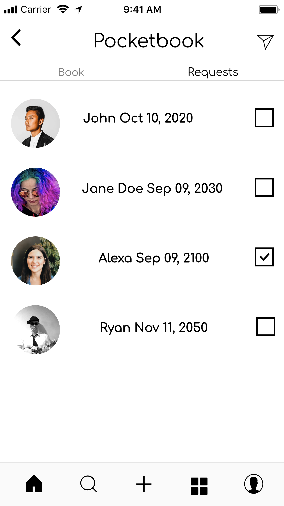 | **ACTIONS** &nbsp;&nbsp;&nbsp;&nbsp;- Click on the **Back Button** to return to *Previous Activity* &nbsp;&nbsp;&nbsp;&nbsp;- Click on the **Notification Icon** to view notifications &nbsp;&nbsp;&nbsp;&nbsp;- Click on the Book Tab to view the selected book &nbsp;&nbsp;&nbsp;&nbsp;- Click on the Requests Tab to view the book's requests &nbsp;&nbsp;&nbsp;&nbsp;- Click on the **Owner's Icon/Username** to view the owner's profile &nbsp;&nbsp;&nbsp;&nbsp;- Click on the **Request Action Button** to accept/decline the book's requests &nbsp;&nbsp;&nbsp;&nbsp;- Click in the **POCKETBOOK FOOTER** to perform footer actions  **MOVERS** &nbsp;&nbsp;&nbsp;&nbsp;- **Back**:  &nbsp;&nbsp;&nbsp;&nbsp;&nbsp;&nbsp;&nbsp;&nbsp;- RETURN TO *Previous Activity* &nbsp;&nbsp;&nbsp;&nbsp;- **Notification**:  &nbsp;&nbsp;&nbsp;&nbsp;&nbsp;&nbsp;&nbsp;&nbsp;- GOTO [Notifications Page](#notifications-page) &nbsp;&nbsp;&nbsp;&nbsp;- **Book Tab**:  &nbsp;&nbsp;&nbsp;&nbsp;&nbsp;&nbsp;&nbsp;&nbsp;- GOTO [Owner Book Page](#owner-book-page) &nbsp;&nbsp;&nbsp;&nbsp;- **Owner's Icon/Username**:  &nbsp;&nbsp;&nbsp;&nbsp;&nbsp;&nbsp;&nbsp;&nbsp;- GOTO [View Owner Page](#view-owner-page) &nbsp;&nbsp;&nbsp;&nbsp;- **Requests Tab**:  &nbsp;&nbsp;&nbsp;&nbsp;&nbsp;&nbsp;&nbsp;&nbsp;- STAY ON [Owner Book Page Requests](#owner-book-page-requests) &nbsp;&nbsp;&nbsp;&nbsp;- **Request Action**:  &nbsp;&nbsp;&nbsp;&nbsp;&nbsp;&nbsp;&nbsp;&nbsp;- LAUNCH [Request Fragment](#request-fragment) &nbsp;&nbsp;&nbsp;&nbsp;- [**POCKETBOOK FOOTER**](#pocketbook-footer)    |

# View Owner Page

| **Screen Mockup**                                            | **Description**                                              |
| ------------------------------------------------------------ | ------------------------------------------------------------ |
| 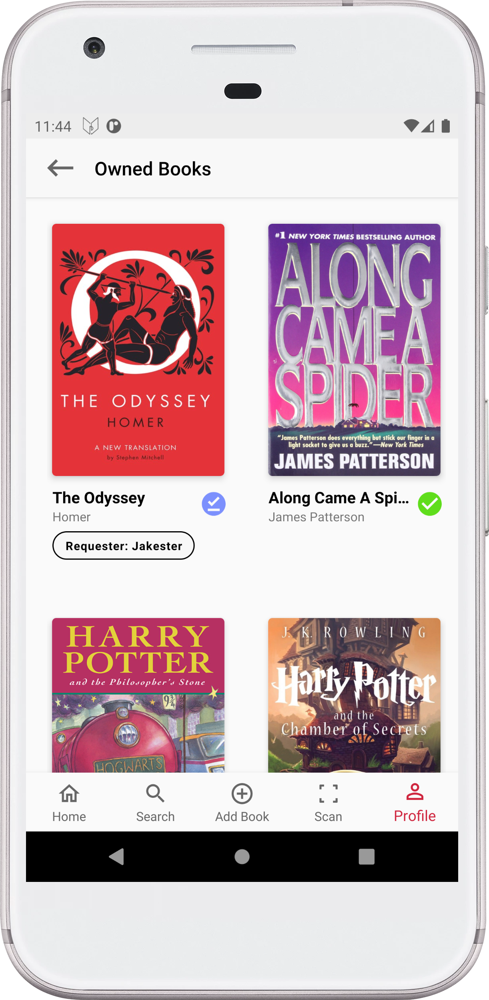 | **ACTIONS** &nbsp;&nbsp;&nbsp;&nbsp;- Click on the **Back Button** to return to *Previous Activity* &nbsp;&nbsp;&nbsp;&nbsp;- Click on the **Notification Icon** to view notifications &nbsp;&nbsp;&nbsp;&nbsp;- Click on a **Book** to go to the Book Page &nbsp;&nbsp;&nbsp;&nbsp;- Click in the **POCKETBOOK FOOTER** to perform footer actions  **MOVERS** &nbsp;&nbsp;&nbsp;&nbsp;- **Back**:  &nbsp;&nbsp;&nbsp;&nbsp;&nbsp;&nbsp;&nbsp;&nbsp;- RETURN TO *Previous Activity* &nbsp;&nbsp;&nbsp;&nbsp;- **Notification**:  &nbsp;&nbsp;&nbsp;&nbsp;&nbsp;&nbsp;&nbsp;&nbsp;- GOTO [Notifications Page](#notifications-page) &nbsp;&nbsp;&nbsp;&nbsp;- **Book**:  &nbsp;&nbsp;&nbsp;&nbsp;&nbsp;&nbsp;&nbsp;&nbsp;- check if user owns book: &nbsp;&nbsp;&nbsp;&nbsp;&nbsp;&nbsp;&nbsp;&nbsp;&nbsp;&nbsp;  - IF owner  &nbsp;&nbsp;&nbsp;&nbsp;&nbsp;&nbsp;&nbsp;&nbsp;&nbsp;&nbsp;&nbsp;&nbsp;&nbsp;&nbsp;&nbsp;&nbsp;- IF book is available GOTO [Owner Book Page](#owner-book-page),  &nbsp;&nbsp;&nbsp;&nbsp;&nbsp;&nbsp;&nbsp;&nbsp;&nbsp;&nbsp;&nbsp;&nbsp;&nbsp;&nbsp;&nbsp;&nbsp;&nbsp;&nbsp;ELSE GOTO [Owner Book Page Not Available](#owner-book-page-not-available) &nbsp;&nbsp;&nbsp;&nbsp;&nbsp;&nbsp;&nbsp;&nbsp;&nbsp;&nbsp;&nbsp;&nbsp;&nbsp;&nbsp;ELSE GOTO [Non Owner Book Page](#non-owner-book-page) &nbsp;&nbsp;&nbsp;&nbsp;- [**POCKETBOOK FOOTER**](#pocketbook-footer)    |

# Add Book Page

| **Screen Mockup**                                            | **Description**                                              |
| ------------------------------------------------------------ | ------------------------------------------------------------ |
| 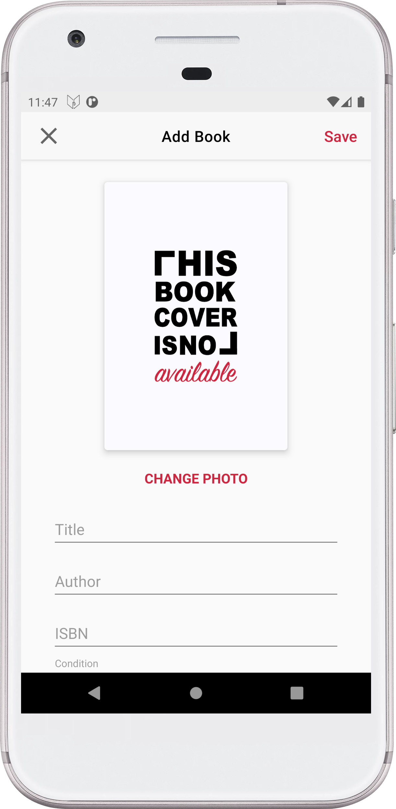 | **ACTIONS** &nbsp;&nbsp;&nbsp;&nbsp;- Click on the **Back Button** to return to *Previous Activity* &nbsp;&nbsp;&nbsp;&nbsp;- Click on the **Notification Icon** to view notifications &nbsp;&nbsp;&nbsp;&nbsp;- Click on the **Picture Rectangle** to add a picture [OPTIONAL?] &nbsp;&nbsp;&nbsp;&nbsp;- Click on the Title field to ENTER title &nbsp;&nbsp;&nbsp;&nbsp;- Click on the Author field to ENTER author &nbsp;&nbsp;&nbsp;&nbsp;- Click on the ISBN field to ENTER ISBN manually &nbsp;&nbsp;&nbsp;&nbsp;- Click on the **Scan Icon** to scan an ISBN &nbsp;&nbsp;&nbsp;&nbsp;- Click on the Comment field to ENTER comment &nbsp;&nbsp;&nbsp;&nbsp;- Click on the **Add Book Button** to add the book &nbsp;&nbsp;&nbsp;&nbsp;- Click in the **POCKETBOOK FOOTER** to perform footer actions  **MOVERS** &nbsp;&nbsp;&nbsp;&nbsp;- **Back**:  &nbsp;&nbsp;&nbsp;&nbsp;&nbsp;&nbsp;&nbsp;&nbsp;- RETURN TO *Previous Activity* &nbsp;&nbsp;&nbsp;&nbsp;- **Notification**:  &nbsp;&nbsp;&nbsp;&nbsp;&nbsp;&nbsp;&nbsp;&nbsp;- GOTO [Notifications Page](#notifications-page) &nbsp;&nbsp;&nbsp;&nbsp;- **Picture**:  &nbsp;&nbsp;&nbsp;&nbsp;&nbsp;&nbsp;&nbsp;&nbsp;- LAUNCH [Add Image Fragment](#add-image-fragment) &nbsp;&nbsp;&nbsp;&nbsp;- **Scan**:  &nbsp;&nbsp;&nbsp;&nbsp;&nbsp;&nbsp;&nbsp;&nbsp;- GOTO [Scan](#scan) &nbsp;&nbsp;&nbsp;&nbsp;- **Add**:  &nbsp;&nbsp;&nbsp;&nbsp;&nbsp;&nbsp;&nbsp;&nbsp;- SAVE book (with available status); RETURN TO *Previous Activity* &nbsp;&nbsp;&nbsp;&nbsp;- [**POCKETBOOK FOOTER**](#pocketbook-footer)    |

# Edit Book Page

| **Screen Mockup**                                            | **Description**                                              |
| ------------------------------------------------------------ | ------------------------------------------------------------ |
| 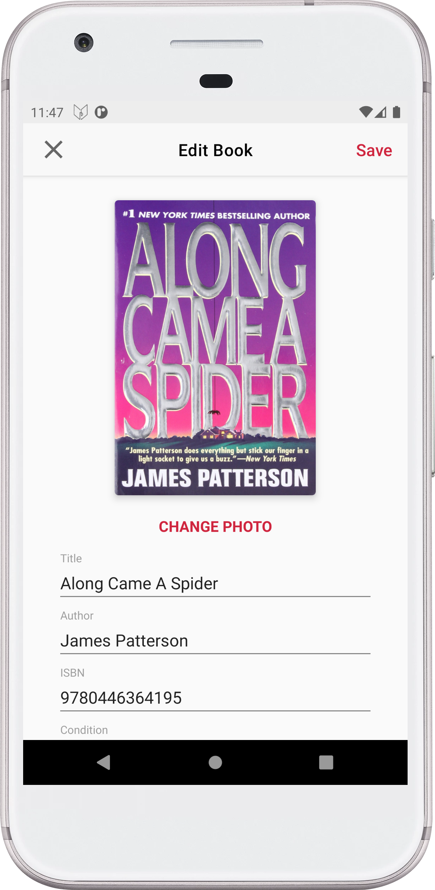 | **ACTIONS** &nbsp;&nbsp;&nbsp;&nbsp;- Click on the **Back Button** to return to *Previous Activity* &nbsp;&nbsp;&nbsp;&nbsp;- Click on the **Notification Icon** to view notifications &nbsp;&nbsp;&nbsp;&nbsp;- Click on the **Picture Rectangle** to edit the picture [OPTIONAL?] &nbsp;&nbsp;&nbsp;&nbsp;- Click on the Title field to MODIFY title &nbsp;&nbsp;&nbsp;&nbsp;- Click on the Author field to MODIFY author &nbsp;&nbsp;&nbsp;&nbsp;- Click on the ISBN field to MODIFY ISBN manually &nbsp;&nbsp;&nbsp;&nbsp;- Click on the **Scan Icon** to scan an ISBN &nbsp;&nbsp;&nbsp;&nbsp;- Click on the Comment field to MODIFY comment &nbsp;&nbsp;&nbsp;&nbsp;- Click on the **Save Changes Button** to save the book edits &nbsp;&nbsp;&nbsp;&nbsp;- Click in the **POCKETBOOK FOOTER** to perform footer actions  **MOVERS** &nbsp;&nbsp;&nbsp;&nbsp;- **Back**:  &nbsp;&nbsp;&nbsp;&nbsp;&nbsp;&nbsp;&nbsp;&nbsp;- RETURN TO *Previous Activity* &nbsp;&nbsp;&nbsp;&nbsp;- **Notification**:  &nbsp;&nbsp;&nbsp;&nbsp;&nbsp;&nbsp;&nbsp;&nbsp;- GOTO [Notifications Page](#notifications-page) &nbsp;&nbsp;&nbsp;&nbsp;- **Picture**:  &nbsp;&nbsp;&nbsp;&nbsp;&nbsp;&nbsp;&nbsp;&nbsp;- LAUNCH [Edit Image Fragment](#add-image-fragment) &nbsp;&nbsp;&nbsp;&nbsp;- **Scan**:  &nbsp;&nbsp;&nbsp;&nbsp;&nbsp;&nbsp;&nbsp;&nbsp;- GOTO [Scan](#scan) &nbsp;&nbsp;&nbsp;&nbsp;- **Save Changes**:  &nbsp;&nbsp;&nbsp;&nbsp;&nbsp;&nbsp;&nbsp;&nbsp;- SAVE book edits; RETURN TO *Previous Activity* &nbsp;&nbsp;&nbsp;&nbsp;- [**POCKETBOOK FOOTER**](#pocketbook-footer)    |

# Scanned Book Description Page

| **Screen Mockup**                                            | **Description**                                              |
| ------------------------------------------------------------ | ------------------------------------------------------------ |
| 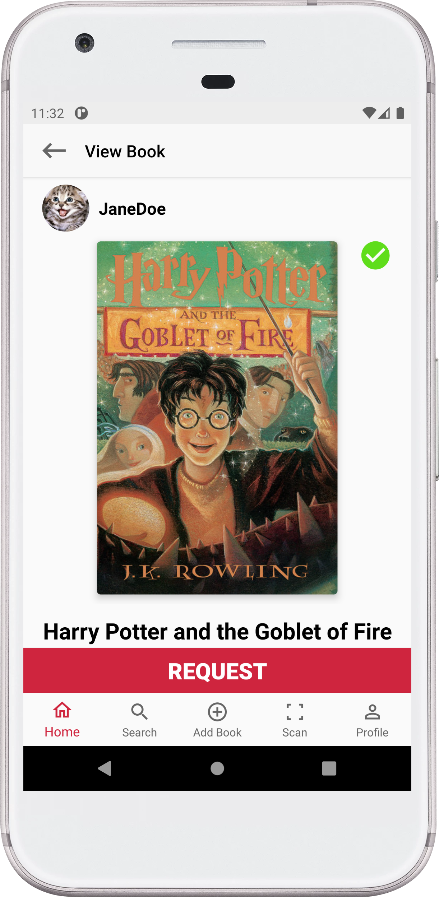 | **ACTIONS** &nbsp;&nbsp;&nbsp;&nbsp;- Click on the **Back Button** to return to *Previous Activity* &nbsp;&nbsp;&nbsp;&nbsp;- Click on the **Notification Icon** to view notifications &nbsp;&nbsp;&nbsp;&nbsp;- Click in the **POCKETBOOK FOOTER** to perform footer actions  **MOVERS** &nbsp;&nbsp;&nbsp;&nbsp;- **Back**:  &nbsp;&nbsp;&nbsp;&nbsp;&nbsp;&nbsp;&nbsp;&nbsp;- RETURN TO *Previous Activity* &nbsp;&nbsp;&nbsp;&nbsp;- **Notification**:  &nbsp;&nbsp;&nbsp;&nbsp;&nbsp;&nbsp;&nbsp;&nbsp;- GOTO [Notifications Page](#notifications-page) &nbsp;&nbsp;&nbsp;&nbsp;- [**POCKETBOOK FOOTER**](#pocketbook-footer)    |

# User Profile Owner Page

| **Screen Mockup**                                            | **Description**                                              |
| ------------------------------------------------------------ | ------------------------------------------------------------ |
| 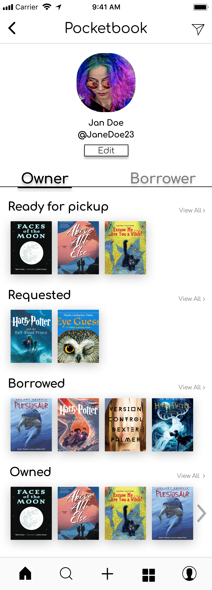 | **ACTIONS** &nbsp;&nbsp;&nbsp;&nbsp;- Click on the **Notification Icon** to view notifications &nbsp;&nbsp;&nbsp;&nbsp;- Click on the **Edit Button** to edit the profile &nbsp;&nbsp;&nbsp;&nbsp;- Click on the Owner Tab to view the books that you own &nbsp;&nbsp;&nbsp;&nbsp;- Click on the Borrower Tab to view the books that others own &nbsp;&nbsp;&nbsp;&nbsp;- Click on a **Book** to go to the Book Page &nbsp;&nbsp;&nbsp;&nbsp;- Click on a **View All** section to view all the books in that section &nbsp;&nbsp;&nbsp;&nbsp;- Click in the **POCKETBOOK FOOTER** to perform footer actions  **MOVERS** &nbsp;&nbsp;&nbsp;&nbsp;- **Notification**:  &nbsp;&nbsp;&nbsp;&nbsp;&nbsp;&nbsp;&nbsp;&nbsp;- GOTO [Notifications Page](#notifications-page) &nbsp;&nbsp;&nbsp;&nbsp;- **Edit**:  &nbsp;&nbsp;&nbsp;&nbsp;&nbsp;&nbsp;&nbsp;&nbsp;- GOTO [Edit Profile Page](#edit-profile-page) &nbsp;&nbsp;&nbsp;&nbsp;- **Owner Tab**:  &nbsp;&nbsp;&nbsp;&nbsp;&nbsp;&nbsp;&nbsp;&nbsp;- STAY ON [User Profile Owner Page](#user-profile-owner-page) &nbsp;&nbsp;&nbsp;&nbsp;- **Borrower Tab**:  &nbsp;&nbsp;&nbsp;&nbsp;&nbsp;&nbsp;&nbsp;&nbsp;- GOTO [User Profile Borrower Tab](#user-profile-borrower-tab) &nbsp;&nbsp;&nbsp;&nbsp;- **Book**:  &nbsp;&nbsp;&nbsp;&nbsp;&nbsp;&nbsp;&nbsp;&nbsp;- IF book is available GOTO [Owner Book Page](#owner-book-page),  &nbsp;&nbsp;&nbsp;&nbsp;&nbsp;&nbsp;&nbsp;&nbsp;&nbsp;&nbsp;ELSE GOTO [Owner Book Page Not Available](#owner-book-page-not-available) &nbsp;&nbsp;&nbsp;&nbsp;- **View All**:  &nbsp;&nbsp;&nbsp;&nbsp;&nbsp;&nbsp;&nbsp;&nbsp;- GOTO [Profile View All Page](#profile-view-all-page) &nbsp;&nbsp;&nbsp;&nbsp;- [**POCKETBOOK FOOTER**](#pocketbook-footer)    |

# User Profile Borrower Tab

| **Screen Mockup**                                            | **Description**                                              |
| ------------------------------------------------------------ | ------------------------------------------------------------ |
| 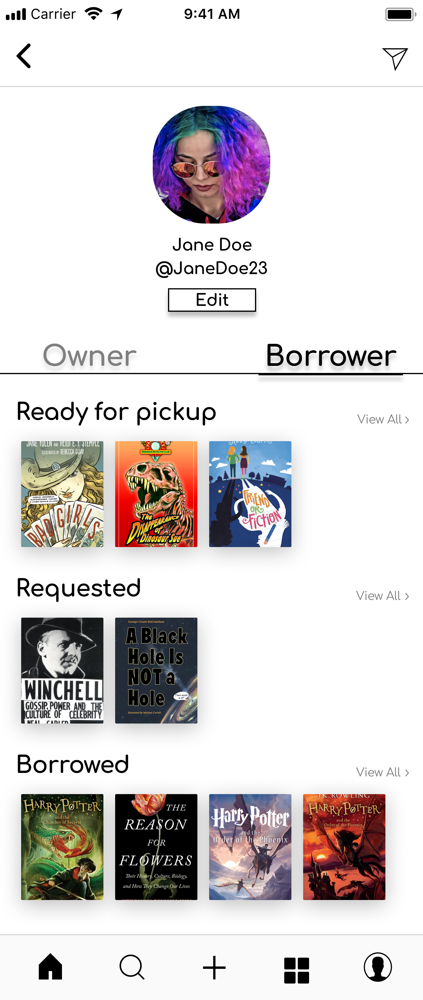 | **ACTIONS** &nbsp;&nbsp;&nbsp;&nbsp;- Click on the **Notification Icon** to view notifications &nbsp;&nbsp;&nbsp;&nbsp;- Click on the **Edit Button** to edit the profile &nbsp;&nbsp;&nbsp;&nbsp;- Click on the Owner Tab to view the books that you own &nbsp;&nbsp;&nbsp;&nbsp;- Click on the Borrower Tab to view the books that others own &nbsp;&nbsp;&nbsp;&nbsp;- Click on a **Book** to go to the Book Page &nbsp;&nbsp;&nbsp;&nbsp;- Click on a **View All** section to view all the books in that section &nbsp;&nbsp;&nbsp;&nbsp;- Click in the **POCKETBOOK FOOTER** to perform footer actions  **MOVERS** &nbsp;&nbsp;&nbsp;&nbsp;- **Notification**:  &nbsp;&nbsp;&nbsp;&nbsp;&nbsp;&nbsp;&nbsp;&nbsp;- GOTO [Notifications Page](#notifications-page) &nbsp;&nbsp;&nbsp;&nbsp;- **Edit**:  &nbsp;&nbsp;&nbsp;&nbsp;&nbsp;&nbsp;&nbsp;&nbsp;- GOTO [Edit Profile Page](#edit-profile-page) &nbsp;&nbsp;&nbsp;&nbsp;- **Owner Tab**:  &nbsp;&nbsp;&nbsp;&nbsp;&nbsp;&nbsp;&nbsp;&nbsp;- GOTO [User Profile Owner Page](#user-profile-owner-page) &nbsp;&nbsp;&nbsp;&nbsp;- **Borrower Tab**:  &nbsp;&nbsp;&nbsp;&nbsp;&nbsp;&nbsp;&nbsp;&nbsp;- STAY ON [User Profile Borrower Tab](#user-profile-borrower-tab) &nbsp;&nbsp;&nbsp;&nbsp;- **Book**:  &nbsp;&nbsp;&nbsp;&nbsp;&nbsp;&nbsp;&nbsp;&nbsp;- GOTO [Non Owner Book Page](#non-owner-book-page) &nbsp;&nbsp;&nbsp;&nbsp;- **View All**:  &nbsp;&nbsp;&nbsp;&nbsp;&nbsp;&nbsp;&nbsp;&nbsp;- GOTO [Profile View All Page](#profile-view-all-page) &nbsp;&nbsp;&nbsp;&nbsp;- [**POCKETBOOK FOOTER**](#pocketbook-footer)    |

# Edit Profile Page

| **Screen Mockup**                                            | **Description**                                              |
| ------------------------------------------------------------ | ------------------------------------------------------------ |
| 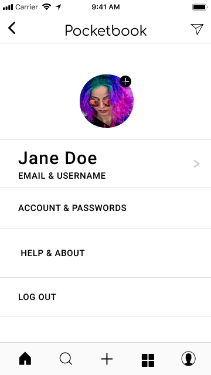 | **ACTIONS** &nbsp;&nbsp;&nbsp;&nbsp;- Click on the **Back Button** to return to *Previous Activity* &nbsp;&nbsp;&nbsp;&nbsp;- Click on the **Picture Circle** to edit a picture [OPTIONAL?] &nbsp;&nbsp;&nbsp;&nbsp;- Click on the First Name field to MODIFY first name &nbsp;&nbsp;&nbsp;&nbsp;- Click on the Last Name field to MODIFY last name &nbsp;&nbsp;&nbsp;&nbsp;- Click on the Email field to MODIFY email &nbsp;&nbsp;&nbsp;&nbsp;- Click on the Username field to MODIFY username &nbsp;&nbsp;&nbsp;&nbsp;- Click on the Password field to MODIFY password &nbsp;&nbsp;&nbsp;&nbsp;- Click on the Retype Password field to RETYPE password &nbsp;&nbsp;&nbsp;&nbsp;- Click on the **Edit Profile Button** to edit the profile  **MOVERS** &nbsp;&nbsp;&nbsp;&nbsp;- **Back**:  &nbsp;&nbsp;&nbsp;&nbsp;&nbsp;&nbsp;&nbsp;&nbsp;- RETURN TO *Previous Activity* &nbsp;&nbsp;&nbsp;&nbsp;- **Picture**:  &nbsp;&nbsp;&nbsp;&nbsp;&nbsp;&nbsp;&nbsp;&nbsp;- LAUNCH [Edit Image Fragment](#edit-image-fragment) &nbsp;&nbsp;&nbsp;&nbsp;- **Edit Profile**:  &nbsp;&nbsp;&nbsp;&nbsp;&nbsp;&nbsp;&nbsp;&nbsp;- validate form: &nbsp;&nbsp;&nbsp;&nbsp;&nbsp;&nbsp;&nbsp;&nbsp;&nbsp;&nbsp;  - IF valid GOTO [User Profile Owner Page](#user-profile-owner-page) &nbsp;&nbsp;&nbsp;&nbsp;&nbsp;&nbsp;&nbsp;&nbsp;&nbsp;&nbsp;&nbsp;&nbsp;&nbsp;&nbsp;ELSE repeat [Edit Profile Page](#edit-profile-page)   |

# Profile View All Page

| **Screen Mockup**                                            | **Description**                                              |
| ------------------------------------------------------------ | ------------------------------------------------------------ |
| 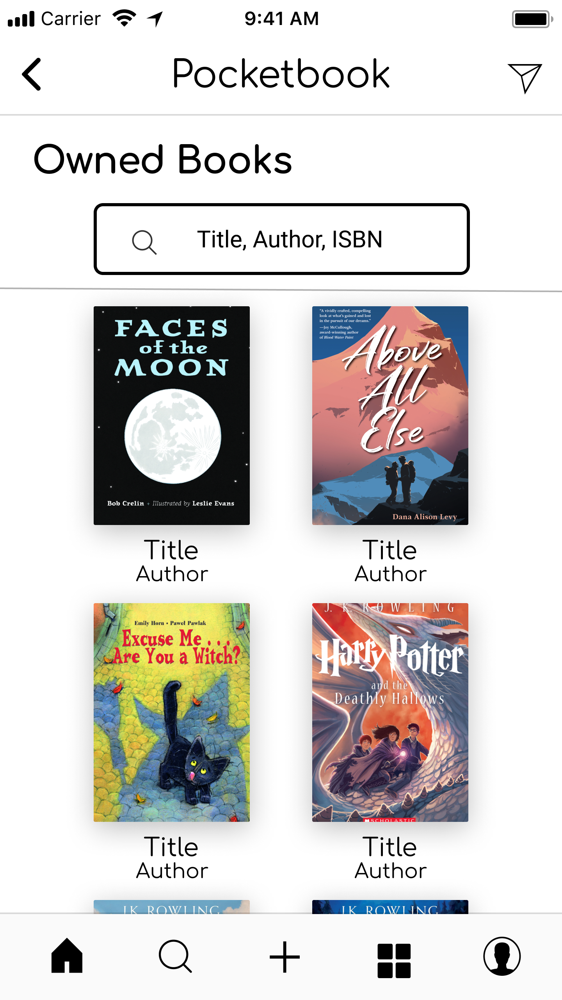 | **ACTIONS** &nbsp;&nbsp;&nbsp;&nbsp;- Click on the **Back Button** to return to *Previous Activity* &nbsp;&nbsp;&nbsp;&nbsp;- Click on the **Notification Icon** to view notifications &nbsp;&nbsp;&nbsp;&nbsp;- Click on the **Filter Icon** to filter the books by status &nbsp;&nbsp;&nbsp;&nbsp;- Click on the **Search Bar** to search through the books &nbsp;&nbsp;&nbsp;&nbsp;- Click on a **Book** to go to the Book Page &nbsp;&nbsp;&nbsp;&nbsp;- Click in the **POCKETBOOK FOOTER** to perform footer actions  **MOVERS** &nbsp;&nbsp;&nbsp;&nbsp;- **Back**:  &nbsp;&nbsp;&nbsp;&nbsp;&nbsp;&nbsp;&nbsp;&nbsp;- RETURN TO *Previous Activity* &nbsp;&nbsp;&nbsp;&nbsp;- **Notification**:  &nbsp;&nbsp;&nbsp;&nbsp;&nbsp;&nbsp;&nbsp;&nbsp;- GOTO [Notifications Page](#notifications-page) &nbsp;&nbsp;&nbsp;&nbsp;- **Filter**:  &nbsp;&nbsp;&nbsp;&nbsp;&nbsp;&nbsp;&nbsp;&nbsp;- LAUNCH [Filter Owned Books Fragment](#filter-owned-books-fragment) &nbsp;&nbsp;&nbsp;&nbsp;- **Search**:  &nbsp;&nbsp;&nbsp;&nbsp;&nbsp;&nbsp;&nbsp;&nbsp;- GOTO [Search Page](#search-page) &nbsp;&nbsp;&nbsp;&nbsp;- **Book**:  &nbsp;&nbsp;&nbsp;&nbsp;&nbsp;&nbsp;&nbsp;&nbsp;- check if user owns book: &nbsp;&nbsp;&nbsp;&nbsp;&nbsp;&nbsp;&nbsp;&nbsp;&nbsp;&nbsp;  - IF owner  &nbsp;&nbsp;&nbsp;&nbsp;&nbsp;&nbsp;&nbsp;&nbsp;&nbsp;&nbsp;&nbsp;&nbsp;&nbsp;&nbsp;&nbsp;&nbsp;- IF book is available GOTO [Owner Book Page](#owner-book-page),  &nbsp;&nbsp;&nbsp;&nbsp;&nbsp;&nbsp;&nbsp;&nbsp;&nbsp;&nbsp;&nbsp;&nbsp;&nbsp;&nbsp;&nbsp;&nbsp;&nbsp;&nbsp;ELSE GOTO [Owner Book Page Not Available](#owner-book-page-not-available) &nbsp;&nbsp;&nbsp;&nbsp;&nbsp;&nbsp;&nbsp;&nbsp;&nbsp;&nbsp;&nbsp;&nbsp;&nbsp;&nbsp;ELSE GOTO [Non Owner Book Page](#non-owner-book-page) &nbsp;&nbsp;&nbsp;&nbsp;- [**POCKETBOOK FOOTER**](#pocketbook-footer)    |

# Profile View All Page Requested

| **Screen Mockup**                                            | **Description**                                              |
| ------------------------------------------------------------ | ------------------------------------------------------------ |
| 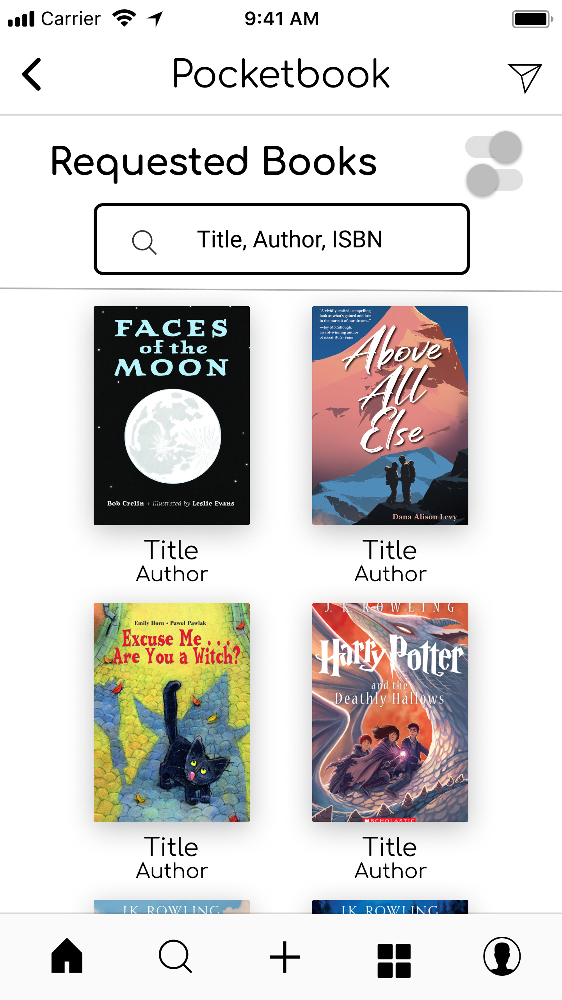 | **ACTIONS** &nbsp;&nbsp;&nbsp;&nbsp;- Click on the **Back Button** to return to *Previous Activity* &nbsp;&nbsp;&nbsp;&nbsp;- Click on the **Notification Icon** to view notifications &nbsp;&nbsp;&nbsp;&nbsp;- Click on the **Search Bar** to search through the books &nbsp;&nbsp;&nbsp;&nbsp;- Click on a **Book** to go to the Book Page &nbsp;&nbsp;&nbsp;&nbsp;- Click in the **POCKETBOOK FOOTER** to perform footer actions  **MOVERS** &nbsp;&nbsp;&nbsp;&nbsp;- **Back**:  &nbsp;&nbsp;&nbsp;&nbsp;&nbsp;&nbsp;&nbsp;&nbsp;- RETURN TO *Previous Activity* &nbsp;&nbsp;&nbsp;&nbsp;- **Notification**:  &nbsp;&nbsp;&nbsp;&nbsp;&nbsp;&nbsp;&nbsp;&nbsp;- GOTO [Notifications Page](#notifications-page) &nbsp;&nbsp;&nbsp;&nbsp;- **Search**:  &nbsp;&nbsp;&nbsp;&nbsp;&nbsp;&nbsp;&nbsp;&nbsp;- GOTO [Search Page](#search-page) &nbsp;&nbsp;&nbsp;&nbsp;- **Book**:  &nbsp;&nbsp;&nbsp;&nbsp;&nbsp;&nbsp;&nbsp;&nbsp;- check if user owns book: &nbsp;&nbsp;&nbsp;&nbsp;&nbsp;&nbsp;&nbsp;&nbsp;&nbsp;&nbsp;  - IF owner  &nbsp;&nbsp;&nbsp;&nbsp;&nbsp;&nbsp;&nbsp;&nbsp;&nbsp;&nbsp;&nbsp;&nbsp;&nbsp;&nbsp;&nbsp;&nbsp;- IF book is available GOTO [Owner Book Page](#owner-book-page),  &nbsp;&nbsp;&nbsp;&nbsp;&nbsp;&nbsp;&nbsp;&nbsp;&nbsp;&nbsp;&nbsp;&nbsp;&nbsp;&nbsp;&nbsp;&nbsp;&nbsp;&nbsp;ELSE GOTO [Owner Book Page Not Available](#owner-book-page-not-available) &nbsp;&nbsp;&nbsp;&nbsp;&nbsp;&nbsp;&nbsp;&nbsp;&nbsp;&nbsp;&nbsp;&nbsp;&nbsp;&nbsp;ELSE GOTO [Non Owner Book Page](#non-owner-book-page) &nbsp;&nbsp;&nbsp;&nbsp;- [**POCKETBOOK FOOTER**](#pocketbook-footer)    |

# Search Page

| **Screen Mockup**                                            | **Description**                                              |
| ------------------------------------------------------------ | ------------------------------------------------------------ |
| 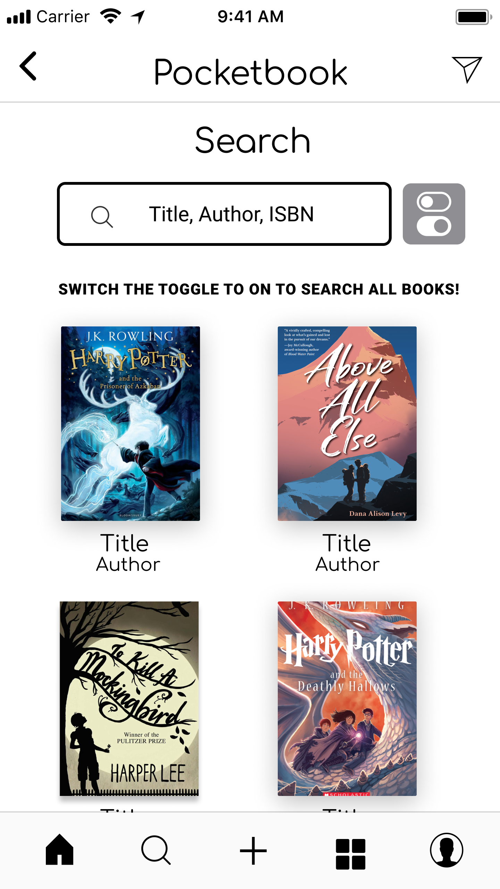 | **ACTIONS** &nbsp;&nbsp;&nbsp;&nbsp;- Click on the **Back Button** to return to *Previous Activity* &nbsp;&nbsp;&nbsp;&nbsp;- Click on the **Notification Icon** to view notifications &nbsp;&nbsp;&nbsp;&nbsp;- Click on the Toggle button to toggle the search type &nbsp;&nbsp;&nbsp;&nbsp;- Click on the **Search Bar** to search through the books &nbsp;&nbsp;&nbsp;&nbsp;- Click in the **POCKETBOOK FOOTER** to perform footer actions  **MOVERS** &nbsp;&nbsp;&nbsp;&nbsp;- **Back**:  &nbsp;&nbsp;&nbsp;&nbsp;&nbsp;&nbsp;&nbsp;&nbsp;- RETURN TO *Previous Activity* &nbsp;&nbsp;&nbsp;&nbsp;- **Notification**:  &nbsp;&nbsp;&nbsp;&nbsp;&nbsp;&nbsp;&nbsp;&nbsp;- GOTO [Notifications Page](#notifications-page) &nbsp;&nbsp;&nbsp;&nbsp;- **Search**:  &nbsp;&nbsp;&nbsp;&nbsp;&nbsp;&nbsp;&nbsp;&nbsp;- GOTO *Results Page* &nbsp;&nbsp;&nbsp;&nbsp;- [**POCKETBOOK FOOTER**](#pocketbook-footer)    |

# Notifications Page

| **Screen Mockup**                                            | **Description**                                              |
| ------------------------------------------------------------ | ------------------------------------------------------------ |
| 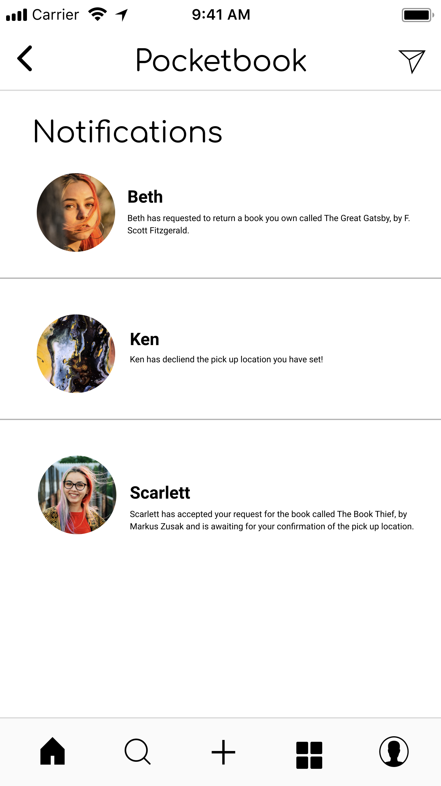 | **ACTIONS** &nbsp;&nbsp;&nbsp;&nbsp;- Click on the **Back Button** to return to *Previous Activity* &nbsp;&nbsp;&nbsp;&nbsp;- Click on the **Owner's Icon/Username** to view the owner's profile &nbsp;&nbsp;&nbsp;&nbsp;- Click on a **Book** (icons on the right) to go to the Book Page &nbsp;&nbsp;&nbsp;&nbsp;- Click in the **POCKETBOOK FOOTER** to perform footer actions  **MOVERS** &nbsp;&nbsp;&nbsp;&nbsp;- **Back**:  &nbsp;&nbsp;&nbsp;&nbsp;&nbsp;&nbsp;&nbsp;&nbsp;- RETURN TO *Previous Activity* &nbsp;&nbsp;&nbsp;&nbsp;- **Owner's Icon/Username**:  &nbsp;&nbsp;&nbsp;&nbsp;&nbsp;&nbsp;&nbsp;&nbsp;- GOTO [View Owner Page](#view-owner-page) &nbsp;&nbsp;&nbsp;&nbsp;- **Book**:  &nbsp;&nbsp;&nbsp;&nbsp;&nbsp;&nbsp;&nbsp;&nbsp;- check if user owns book: &nbsp;&nbsp;&nbsp;&nbsp;&nbsp;&nbsp;&nbsp;&nbsp;&nbsp;&nbsp;  - IF owner  &nbsp;&nbsp;&nbsp;&nbsp;&nbsp;&nbsp;&nbsp;&nbsp;&nbsp;&nbsp;&nbsp;&nbsp;&nbsp;&nbsp;&nbsp;&nbsp;- IF book is available GOTO [Owner Book Page](#owner-book-page),  &nbsp;&nbsp;&nbsp;&nbsp;&nbsp;&nbsp;&nbsp;&nbsp;&nbsp;&nbsp;&nbsp;&nbsp;&nbsp;&nbsp;&nbsp;&nbsp;&nbsp;&nbsp;ELSE GOTO [Owner Book Page Not Available](#owner-book-page-not-available) &nbsp;&nbsp;&nbsp;&nbsp;&nbsp;&nbsp;&nbsp;&nbsp;&nbsp;&nbsp;&nbsp;&nbsp;&nbsp;&nbsp;ELSE GOTO [Non Owner Book Page](#non-owner-book-page) &nbsp;&nbsp;&nbsp;&nbsp;- [**POCKETBOOK FOOTER**](#pocketbook-footer)    |

# Set Location Page

| **Screen Mockup**                                            | **Description**                                              |
| ------------------------------------------------------------ | ------------------------------------------------------------ |
|  | The Map shows where the pickup meetingDetails is.  &nbsp;&nbsp;&nbsp;&nbsp;**ACTIONS** &nbsp;&nbsp;&nbsp;&nbsp;- Click on the **Back Button** to return to *Previous Activity* &nbsp;&nbsp;&nbsp;&nbsp;- Click on the **Notification Icon** to view notifications &nbsp;&nbsp;&nbsp;&nbsp;- Click on the **Set Pickup Location Button** to set the meetingDetails &nbsp;&nbsp;&nbsp;&nbsp;- Click on the **Confirm Location Button** to confirm the chosen meetingDetails &nbsp;&nbsp;&nbsp;&nbsp;- Click in the **POCKETBOOK FOOTER** to perform footer actions  **MOVERS** &nbsp;&nbsp;&nbsp;&nbsp;- **Back**:  &nbsp;&nbsp;&nbsp;&nbsp;&nbsp;&nbsp;&nbsp;&nbsp;- RETURN TO *Previous Activity* &nbsp;&nbsp;&nbsp;&nbsp;- **Notification**:  &nbsp;&nbsp;&nbsp;&nbsp;&nbsp;&nbsp;&nbsp;&nbsp;- GOTO [Notifications Page](#notifications-page) &nbsp;&nbsp;&nbsp;&nbsp;- **Set Pickup Location**:  &nbsp;&nbsp;&nbsp;&nbsp;&nbsp;&nbsp;&nbsp;&nbsp;- GOTO [Google Maps](#google-maps) TO [Set Location Page](#set-meetingDetails-page) &nbsp;&nbsp;&nbsp;&nbsp;- **Confirm Location**:  &nbsp;&nbsp;&nbsp;&nbsp;&nbsp;&nbsp;&nbsp;&nbsp;- RETURN TO *Previous Activity* &nbsp;&nbsp;&nbsp;&nbsp;- [**POCKETBOOK FOOTER**](#pocketbook-footer)    |

# Get Location Page

| **Screen Mockup**                                            | **Description**                                              |
| ------------------------------------------------------------ | ------------------------------------------------------------ |
| 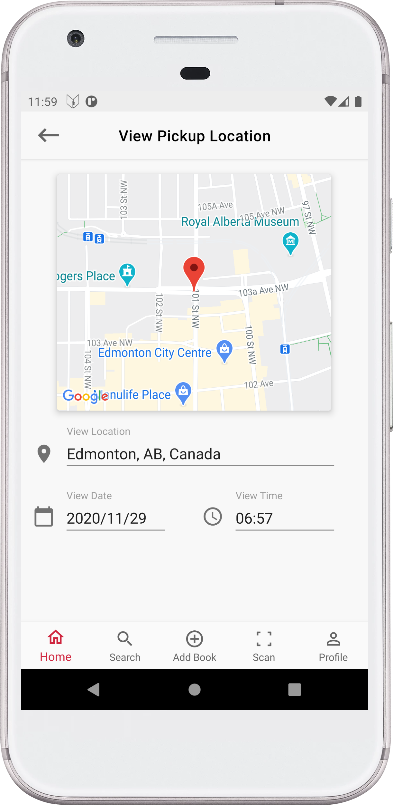 | The Map shows where the pickup meetingDetails is.  &nbsp;&nbsp;&nbsp;&nbsp;**ACTIONS** &nbsp;&nbsp;&nbsp;&nbsp;- Click on the **Back Button** to return to *Previous Activity* &nbsp;&nbsp;&nbsp;&nbsp;- Click on the **Notification Icon** to view notifications &nbsp;&nbsp;&nbsp;&nbsp;- Click on the **ETA Location Button** to get directions to the meetingDetails &nbsp;&nbsp;&nbsp;&nbsp;- Click in the **POCKETBOOK FOOTER** to perform footer actions  **MOVERS** &nbsp;&nbsp;&nbsp;&nbsp;- **Back**:  &nbsp;&nbsp;&nbsp;&nbsp;&nbsp;&nbsp;&nbsp;&nbsp;- RETURN TO *Previous Activity* &nbsp;&nbsp;&nbsp;&nbsp;- **Notification**:  &nbsp;&nbsp;&nbsp;&nbsp;&nbsp;&nbsp;&nbsp;&nbsp;- GOTO [Notifications Page](#notifications-page) &nbsp;&nbsp;&nbsp;&nbsp;- **ETA Location**:  &nbsp;&nbsp;&nbsp;&nbsp;&nbsp;&nbsp;&nbsp;&nbsp;- GOTO [Google Maps](#google-maps) TO [Get Location Page](#get-meetingDetails-page) &nbsp;&nbsp;&nbsp;&nbsp;- [**POCKETBOOK FOOTER**](#pocketbook-footer)    |

# Edit Image Fragment

| **Screen Mockup**                                            | **Description**                                              |
| ------------------------------------------------------------ | ------------------------------------------------------------ |
| 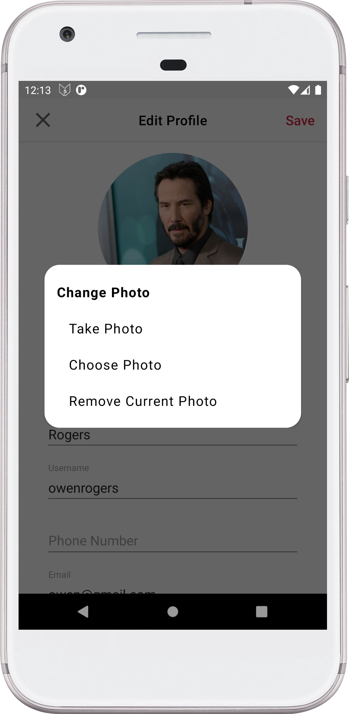 | **ACTIONS** &nbsp;&nbsp;&nbsp;&nbsp;- Click on the **Select Photo Button** to go to the Android Gallery &nbsp;&nbsp;&nbsp;&nbsp;- Click on the **Take Photo Button** to go to the Camera App &nbsp;&nbsp;&nbsp;&nbsp;- Click on the **Remove Photo Button** to return to the Sign Up Page  **MOVERS** &nbsp;&nbsp;&nbsp;&nbsp;- **Select Photo**:  &nbsp;&nbsp;&nbsp;&nbsp;&nbsp;&nbsp;&nbsp;&nbsp;- GOTO [Android Gallery](#android-gallery) TO [Confirm Photo Page](#confirm-photo-page) TO *Previous Activity* &nbsp;&nbsp;&nbsp;&nbsp;- **Take Photo**:  &nbsp;&nbsp;&nbsp;&nbsp;&nbsp;&nbsp;&nbsp;&nbsp;- GOTO [Camera App](#camera-app) TO [Confirm Photo Page](#confirm-photo-page) TO *Previous Activity* &nbsp;&nbsp;&nbsp;&nbsp;- **Remove Photo**:  &nbsp;&nbsp;&nbsp;&nbsp;&nbsp;&nbsp;&nbsp;&nbsp;- RETURN TO *Previous Activity* (after removing photo)   |

# Request Fragment

| **Screen Mockup**                                            | **Description**                                              |
| ------------------------------------------------------------ | ------------------------------------------------------------ |
| 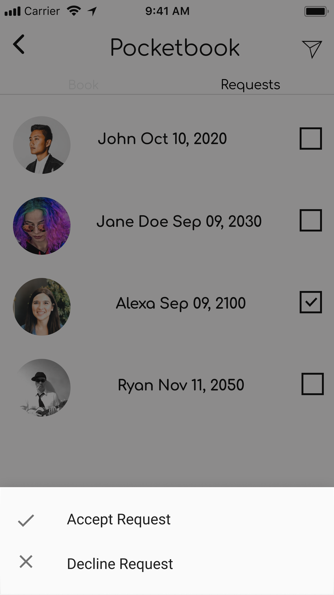 | **ACTIONS** &nbsp;&nbsp;&nbsp;&nbsp;- Click on the **Accept Request Button** to accept the request &nbsp;&nbsp;&nbsp;&nbsp;- Click on the **Decline Request Button** to decline the request &nbsp;&nbsp;&nbsp;&nbsp;- Click on the **Cancel Button** to exit the fragment  **MOVERS** &nbsp;&nbsp;&nbsp;&nbsp;- **Accept Request**:  &nbsp;&nbsp;&nbsp;&nbsp;&nbsp;&nbsp;&nbsp;&nbsp;- SEND accept request &nbsp;&nbsp;&nbsp;&nbsp;&nbsp;&nbsp;&nbsp;&nbsp;- NOTIFY Borrower that request is accepted &nbsp;&nbsp;&nbsp;&nbsp;&nbsp;&nbsp;&nbsp;&nbsp;- SEND decline request to other requesters &nbsp;&nbsp;&nbsp;&nbsp;&nbsp;&nbsp;&nbsp;&nbsp;- CHANGE book status from REQUESTED to ACCEPTED &nbsp;&nbsp;&nbsp;&nbsp;&nbsp;&nbsp;&nbsp;&nbsp;- RETURN to *Previous Activity*  &nbsp;&nbsp;&nbsp;&nbsp;- **Decline Request**:  &nbsp;&nbsp;&nbsp;&nbsp;&nbsp;&nbsp;&nbsp;&nbsp;- SEND decline request &nbsp;&nbsp;&nbsp;&nbsp;&nbsp;&nbsp;&nbsp;&nbsp;- NOTIFY Borrower that request is declined &nbsp;&nbsp;&nbsp;&nbsp;&nbsp;&nbsp;&nbsp;&nbsp;- IF there are no other requests &nbsp;&nbsp;&nbsp;&nbsp;&nbsp;&nbsp;&nbsp;&nbsp;&nbsp;&nbsp;   - CHANGE book status from REQUESTED to AVAILABLE &nbsp;&nbsp;&nbsp;&nbsp;&nbsp;&nbsp;&nbsp;&nbsp;- RETURN to *Previous Activity*  &nbsp;&nbsp;&nbsp;&nbsp;- **Cancel**:  &nbsp;&nbsp;&nbsp;&nbsp;&nbsp;&nbsp;&nbsp;&nbsp;- RETURN to *Previous Activity*    |

# Delete Fragment

| **Screen Mockup**                                            | **Description**                                              |
| ------------------------------------------------------------ | ------------------------------------------------------------ |
| 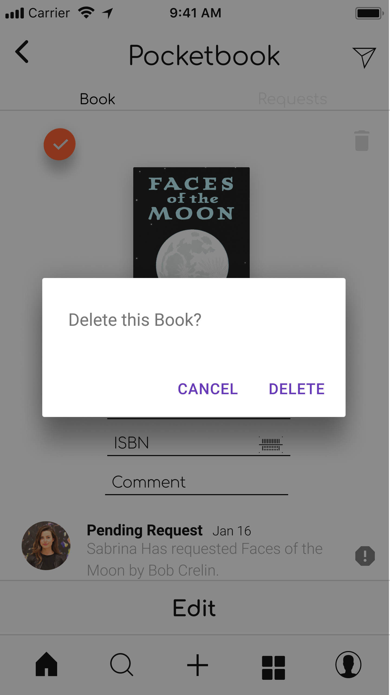 | **ACTIONS** &nbsp;&nbsp;&nbsp;&nbsp;- Click on the **Yes Button** to confirm the deletion &nbsp;&nbsp;&nbsp;&nbsp;- Click on the **Cancel Button** to exit the fragment  **MOVERS** &nbsp;&nbsp;&nbsp;&nbsp;- **YES**:  &nbsp;&nbsp;&nbsp;&nbsp;&nbsp;&nbsp;&nbsp;&nbsp;- DELETE the specified item &nbsp;&nbsp;&nbsp;&nbsp;&nbsp;&nbsp;&nbsp;&nbsp;- RETURN to *Previous Activity*  &nbsp;&nbsp;&nbsp;&nbsp;- **Cancel**:  &nbsp;&nbsp;&nbsp;&nbsp;&nbsp;&nbsp;&nbsp;&nbsp;- RETURN to *Previous Activity*    |

# Filter Owned Books Fragment

| **Screen Mockup**                                            | **Description**                                              |
| ------------------------------------------------------------ | ------------------------------------------------------------ |
| 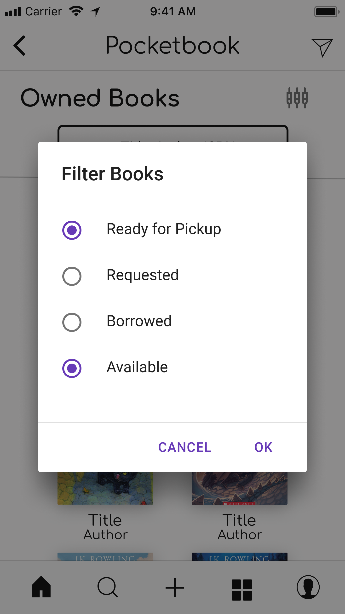 | **ACTIONS** &nbsp;&nbsp;&nbsp;&nbsp;- Click on the **Ready for Pickup Button** to see ACCEPTED books &nbsp;&nbsp;&nbsp;&nbsp;- Click on the **Requested Button** to see REQUESTED books &nbsp;&nbsp;&nbsp;&nbsp;- Click on the **Borrowed Button** to see BORROWED books &nbsp;&nbsp;&nbsp;&nbsp;- Click on the **Owned Button** to see OWNED books  **MOVERS** &nbsp;&nbsp;&nbsp;&nbsp;- **Ready for Pickup**:  &nbsp;&nbsp;&nbsp;&nbsp;&nbsp;&nbsp;&nbsp;&nbsp;- Include accepted books in [Profile View All Page](#profile-view-all-page) list &nbsp;&nbsp;&nbsp;&nbsp;- **Requested**:  &nbsp;&nbsp;&nbsp;&nbsp;&nbsp;&nbsp;&nbsp;&nbsp;- Include requested books in [Profile View All Page](#profile-view-all-page) list &nbsp;&nbsp;&nbsp;&nbsp;- **Borrowed**:  &nbsp;&nbsp;&nbsp;&nbsp;&nbsp;&nbsp;&nbsp;&nbsp;- Include borrowed books in [Profile View All Page](#profile-view-all-page) list &nbsp;&nbsp;&nbsp;&nbsp;- **Owned**:  &nbsp;&nbsp;&nbsp;&nbsp;&nbsp;&nbsp;&nbsp;&nbsp;- Include owned books in [Profile View All Page](#profile-view-all-page) list &nbsp;&nbsp;&nbsp;&nbsp;- **Apply**:  &nbsp;&nbsp;&nbsp;&nbsp;&nbsp;&nbsp;&nbsp;&nbsp;- RETURN to *Previous Activity* with filter options set   |

# Scan Book Fragment

| **Screen Mockup**                                            | **Description**                                              |
| ------------------------------------------------------------ | ------------------------------------------------------------ |
| 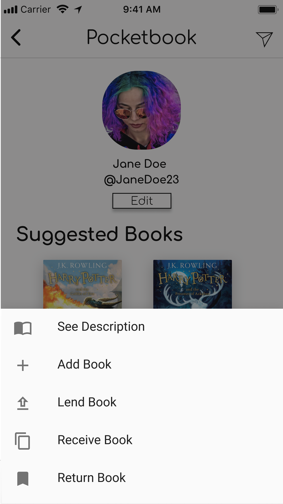 | **ACTIONS** &nbsp;&nbsp;&nbsp;&nbsp;- Click on the **See Description Button** to see the scanned book's description &nbsp;&nbsp;&nbsp;&nbsp;- Click on the **Add Book** to add the book &nbsp;&nbsp;&nbsp;&nbsp;- Click on the **Lend Book Button** to lend the book &nbsp;&nbsp;&nbsp;&nbsp;- Click on the **Receive Book Button** to receive the book &nbsp;&nbsp;&nbsp;&nbsp;- Click on the **Return Book Button** to return the book  **MOVERS** &nbsp;&nbsp;&nbsp;&nbsp;- **See Description**:  &nbsp;&nbsp;&nbsp;&nbsp;&nbsp;&nbsp;&nbsp;&nbsp;- GOTO [Scanned Book Description Page](#scanned-book-description-page) &nbsp;&nbsp;&nbsp;&nbsp;- **Add Book**:  &nbsp;&nbsp;&nbsp;&nbsp;&nbsp;&nbsp;&nbsp;&nbsp;- GOTO [Add Book Page](#add-book-page) (and prefill fields) &nbsp;&nbsp;&nbsp;&nbsp;- **Lend Book**:  &nbsp;&nbsp;&nbsp;&nbsp;&nbsp;&nbsp;&nbsp;&nbsp;- CHANGE book status from ACCEPTED to BORROWED &nbsp;&nbsp;&nbsp;&nbsp;&nbsp;&nbsp;&nbsp;&nbsp;- RETURN to *Previous Activity* &nbsp;&nbsp;&nbsp;&nbsp;- **Receive Book**:  &nbsp;&nbsp;&nbsp;&nbsp;&nbsp;&nbsp;&nbsp;&nbsp;- CHANGE book status from BORROWED to AVAILABLE &nbsp;&nbsp;&nbsp;&nbsp;&nbsp;&nbsp;&nbsp;&nbsp;- RETURN to *Previous Activity* &nbsp;&nbsp;&nbsp;&nbsp;- **Return Book**:  &nbsp;&nbsp;&nbsp;&nbsp;&nbsp;&nbsp;&nbsp;&nbsp;- CHANGE book status from BORROWED to AVAILABLE &nbsp;&nbsp;&nbsp;&nbsp;&nbsp;&nbsp;&nbsp;&nbsp;- RETURN to *Previous Activity*   |

# Add Book Fragment

| **Screen Mockup**                                            | **Description**                                              |
| ------------------------------------------------------------ | ------------------------------------------------------------ |
| 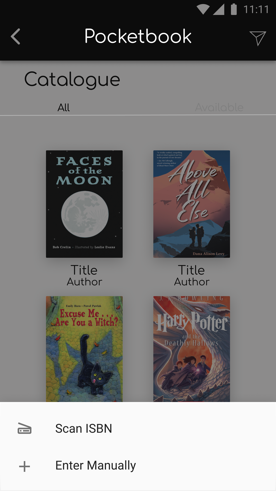 | **ACTIONS** &nbsp;&nbsp;&nbsp;&nbsp;- Click on the **Scan ISBN Button** to scan the book's ISBN &nbsp;&nbsp;&nbsp;&nbsp;- Click on the **Enter Manually Button** to enter the book by hand &nbsp;&nbsp;&nbsp;&nbsp;- Click on the **Cancel Button** to exit the fragment  **MOVERS** &nbsp;&nbsp;&nbsp;&nbsp;- **Scan ISBN**:  &nbsp;&nbsp;&nbsp;&nbsp;&nbsp;&nbsp;&nbsp;&nbsp;- GOTO [Scan](#scan)  &nbsp;&nbsp;&nbsp;&nbsp;- **Enter Manually**:  &nbsp;&nbsp;&nbsp;&nbsp;&nbsp;&nbsp;&nbsp;&nbsp;- GOTO [Add Book Page](#add-book-page)  &nbsp;&nbsp;&nbsp;&nbsp;- **Cancel**:  &nbsp;&nbsp;&nbsp;&nbsp;&nbsp;&nbsp;&nbsp;&nbsp;- RETURN to *Previous Activity*    |

# System Activities/Dialogs

## Android Gallery

| **From**                                  | **To**                                    |
| ----------------------------------------- | ----------------------------------------- |
| [Add Image Fragment](#add-image-fragment) | [Confirm Photo Page](#confirm-photo-page) |

## Camera App

| **From**                                  | **To**                                    |
| ----------------------------------------- | ----------------------------------------- |
| [Add Image Fragment](#add-image-fragment) | [Confirm Photo Page](#confirm-photo-page) |

## Scan

| **From**                                                     | **To**                         |
| ------------------------------------------------------------ | ------------------------------ |
| [Add Book Page](#add-book-page) [Edit Book Page](#edit-book-page) [Add Book Fragment](#add-book-fragment) [**POCKETBOOK FOOTER**](#pocketbook-footer) | *Calling Activity or Fragment* |

## Notifications

| **From**           | **To**            |
| ------------------ | ----------------- |
| *Calling Activity* | *Result Activity* |

## Google Maps

| **From**                                                     | **To**                                                       |
| ------------------------------------------------------------ | ------------------------------------------------------------ |
| [Set Location Page](#set-meetingDetails-page) [Get Location Page](#get-meetingDetails-page) | [Set Location Page](#set-meetingDetails-page) [Get Location Page](#get-meetingDetails-page) |

